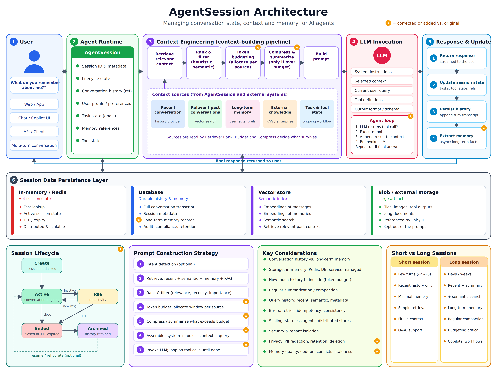

# TODO

Open items for Louis Agent. Add to this list as new work comes up; check items off (or delete them) once done.

## Known limitations ([docs/CLAUDE.md](docs/CLAUDE.md#known-limitations))

- [ ] Rider MCP discovery only logs Rider's tools; they aren't callable yet (needs a full MCP client)
- [ ] Sessions are in memory in the API and ACP server; a restart ends them (the web app keeps the transcript)
- [ ] Ollama tool support is a name heuristic (`LlmOptions.KnownNoToolsPrefixes`)
- [ ] Paymo task lookup takes the first match for a name; ambiguous names can hit the wrong task
- [ ] No rate limiting or audit log beyond the file logs

## Testing

- [ ] The API and web app have no automated tests yet; only checked by hand (curl and a browser)

## Session architecture (AgentSession)

Current `AgentSession` (`src/louis-agent.api/AgentSessions.cs`) is just an in-memory `List<ChatMessage>` per session
id, dropped on idle timeout or restart. It conflates "conversation history" with "what the model sees" and has no
durable storage, memory, or retrieval. The diagram above is the target shape; broken down into workstreams:

### AgentSession (runtime state)

- [ ] Separate **session state** (identity, task state, memory references) from **LLM context** (what actually goes
      in the prompt) — session ≠ model memory
- [ ] Extend `AgentSession` beyond id + history: lifecycle state, user profile/preferences, task state (goals), memory
      references, tool state — currently only id, history and the turn lock exist
- [ ] Give the session durable storage instead of only the in-process `ConcurrentDictionary`: a DB for full
      conversation history, so a restart doesn't lose it (ties into the existing "sessions are in memory" limitation)

### Context engineering pipeline

- [ ] Introduce a context-building step between session and LLM call: retrieve → rank & filter → token budget →
      compress/summarize (only if over budget) → build prompt, instead of sending the full/raw history every turn
- [ ] Distinguish the context sources currently blurred into one history list: recent conversation, relevant past
      conversations (semantic search), long-term memory (user facts/prefs), external knowledge (RAG), task & tool
      state — each has a different retrieval method
- [ ] Replace "send the last N messages" with ranked retrieval: recent + semantic search + keyword search + metadata
      filters + recency/importance, then select only the most relevant before assembling the prompt
- [ ] Add a token budget allocator that assigns a window per context source before compression kicks in
- [ ] Add history compaction for long conversations: recent messages verbatim + summarized/compacted older history +
      selective retrieval, instead of unbounded growth or a hard cutoff

### LLM invocation & response

- [ ] Formalize the assembled prompt's shape: system instructions, selected context, current query, tool
      definitions, output format/schema — as an explicit object, not ad hoc message construction
- [ ] After the turn: persist the new turn to history, update session state (tasks/tool state/refs), and extract
      long-term memory facts asynchronously (none of this happens today — the session is mutated in place only)

### Persistence layer

- [ ] Split storage by access pattern instead of one in-memory dictionary for everything: Redis/in-memory for hot
      session state (fast lookup, TTL), DB for durable transcript + long-term memory + audit/retention, vector store
      for embeddings/semantic search, blob storage for large artifacts (files, images, tool outputs) kept out of the
      prompt

### Session lifecycle

- [ ] Model explicit lifecycle states (create → active ⇄ idle → ended → archived) instead of only "exists until idle
      timeout removes it"; consider resume/rehydrate from archived state

### Open design questions (from "Key Considerations")

- [ ] How much history to include (token budget) and when to trigger summarization/compaction
- [ ] Error handling for the context pipeline: retries, idempotency, consistency across storage layers
- [ ] Scaling: keep agent runtime stateless, push state into distributed stores
- [ ] Security & tenant isolation between sessions/users
- [ ] Privacy: PII redaction, retention policy, deletion
- [ ] Memory quality: dedupe, conflict resolution, staleness of long-term memory facts
- [ ] Decide the short-session vs. long-session tradeoff explicitly (few turns/recent-only vs. days-long with
      summarization + semantic search) rather than one fixed strategy for every session

## Ideas / backlog

### Ops / CI

- [ ] Add CI (`.github/workflows`) to run `dotnet build` / `dotnet test` on push/PR — there's no CI at all today, so
      regressions are only caught locally
- [ ] Track token usage / cost per session — useful given this proxies to paid Anthropic calls
- [ ] Add metrics/tracing (e.g. OpenTelemetry) beyond the stderr + JSONL file logs (`AgentLog`) — no
      latency/error dashboards today
- [ ] Add model fallback: retry against a secondary provider/model if the configured one errors or rate-limits.
      Checked: Anthropic's native `fallbacks` parameter (`Anthropic.Models.Beta.Messages.MessageCreateParams`) doesn't
      satisfy this — it only fires on a policy *refusal*, is Anthropic-model-only (no fallback to Ollama/openai-compatible),
      and needs the beta client surface this repo doesn't use. Hand-rolled retry/fallback logic is still required for
      the error/rate-limit case this item actually wants.
- [ ] Wire up Anthropic prompt caching on the system prompt — confirmed available on the exact call path already in
      use (`Anthropic` NuGet 12.53.0's `AsIChatClient`, in `LlmClientFactory.cs`): `TextContent.WithCacheControl(...)`
      for messages/system content and `Tool.CacheControl` via `AIFunctionFactoryOptions.AdditionalProperties` for
      tools, both documented in the package's own XML docs. Not wired up anywhere today. The system prompt (composed
      skill docs) is rebuilt identically every turn, making it a strong candidate — cached reads are ~0.1× the
      uncached input price.
- [ ] Wire up structured outputs (`output_config.format` / `JsonOutputFormat`) where the engine needs a model response
      shaped as JSON — confirmed present on the repo's existing **non-beta** call path (no client switch needed), via
      `Anthropic.Models.Messages.OutputConfig`/`JsonOutputFormat`, and currently unused anywhere in `AgentEngine.cs`.
- [ ] Consider context editing (`clear_tool_uses_20250919`, clears stale tool results from a long conversation) and
      compaction (`compact_20260112`, server-side summarization of old history) for long-running sessions — both are
      confirmed present in the installed Anthropic SDK, but only on the **beta** `MessageCreateParams.ContextManagement`
      surface, which means switching from `AnthropicClient.AsIChatClient` to the beta client, not just a config flag.
      Neither would replace the engine's existing `SummariseToolResultAsync` (which shrinks one oversized tool result
      before it enters history) — they solve long-session accumulation, a different problem, so would supplement it.
- [ ] Rewrite tool `[Description]` attributes to the current bar (3+ sentences, explicit when-*not*-to-use, precise
      behavior). Checked across `WorkspaceTools.cs`, `GitTools.cs`, `DevOpsTools.cs`: every sampled description is a
      single short clause (e.g. `GitTools.cs`'s `Push`: "Push commits to a remote branch.") — correct but under-specified,
      which is the single biggest lever for tool-selection accuracy per Anthropic's current tool-use guidance.

### Web app

- [ ] Add automated tests for `louis-agent.web` (bUnit/Playwright) — currently hand-checked only
- [ ] Sync chat history across devices/browsers instead of only `localStorage` (lost on clearing site data)
- [ ] Add a UI for managing skills (`Skills/*.md`) and for reviewing/approving agent-built tools — `/approve` is
      CLI-only today

### CLI

- [ ] Let the CLI resume a previous session's history across restarts (the web app keeps it in `localStorage`; the
      CLI and ACP server don't persist it)

### Tooling / multi-repo

- [ ] Add a tool for searching/operating across more than one mounted repo at once — `REPOSITORIES_PATH` mounts
      multiple repos, but every tool call is scoped to a single workspace root
- [ ] Add a marketplace/sharing mechanism for agent-built tools (`Skills/tools/pending`) between projects or
      teammates — each repo builds its own from scratch today

### Self-healing (within `louis-agent`)

This is in scope for `louis-agent` as-is — it's the normal fix/test/PR loop, just triggered by an error instead of a
prompt. Default to the guarded path (PR + approval) before any auto-deploy path, since deploys are hard-to-reverse,
shared-system actions.

- [ ] Add `ExceptionlessTools` wrapping the Exceptionless API (new/trending errors, stack trace, affected
      endpoint, frequency) — same pattern as `PaymoTools`/`DevOpsTools`
- [ ] Build an exception-driven triage loop: pull an error → locate the failing code → write a fix → run tests →
      open a PR (default), with full auto-deploy-on-green as an explicit opt-in per environment rather than the default
- [ ] Add a rollback/kill-switch tool: auto-revert to the previous release if error rate spikes right after an
      agent-triggered deploy, instead of waiting for a human to notice
- [ ] Add synthetic monitoring / uptime + performance-regression checks feeding the same triage loop — not every
      production problem throws an exception (slow checkout, broken layout)
- [ ] Add a scheduled maintenance agent (dependency bumps, security patch sweeps) using the existing cron/schedule
      mechanism — proactive, not just reactive
- [ ] Add a dependency/CVE watcher that fires the same fix → test → PR pipeline when a package advisory lands

### Autonomous store operations (separate orchestrator agent)

Out of scope for `louis-agent` itself — a store-ops orchestrator is a different kind of agent (owns business state
and deploy/rollback decisions, runs on a schedule, watches metrics) that calls `louis-agent` as a sub-agent for
anything that's actually a code change. `louis-agent.mcp-server` already publishes the full toolset to any MCP
client, so that's the natural integration point rather than growing business-domain tools into this repo.

- [ ] Design the orchestrator agent: watches store health (errors, uptime, performance), decides code-fix vs.
      ops-action vs. escalate-to-human, and calls `louis-agent` over MCP for code-fix work
- [ ] Add catalog/inventory/pricing tools (stock sync, price updates) to the orchestrator so it can act on business
      state directly, without routing non-code actions through `louis-agent`
- [ ] Define the approval/deploy-gate boundary between the two agents: orchestrator decides *when* to ship,
      `louis-agent` only produces the *fix* — keeps blast radius of agent-written code changes separate from
      business-critical deploy/rollback decisions

#### Design: one orchestrator per microservice

For a store built as several microservices, scope one orchestrator *configuration* per microservice rather than one
orchestrator watching the whole store, and rather than embedding the watcher inside each microservice's own process.

- [ ] **Scoping = a skill file per microservice**, the same mechanism `AGENT_FUNCTION` already uses to select a skill
      set per run (`docs/CLAUDE.md` → "Adding a skill"). One orchestrator engine/codebase, N skill files
      (`order-service-skills.md`, `payment-service-skills.md`, `catalog-service-skills.md`, ...), each declaring:
      its microservice's Exceptionless project id, its repo location, its escalation rules (what counts as
      auto-fixable vs. needs-a-human), and any business actions specific to that service (e.g. payment-service might
      never auto-deploy, order-service might auto-restart a stuck worker).
- [ ] **Don't run the watcher inside the microservice it watches** — if the service crashes, its own watchdog
      shouldn't crash with it. Run the orchestrator as its own process/deployment per microservice (or per group of
      related microservices), not as a library loaded into the microservice's runtime.
- [ ] **Process topology is a deploy choice, not an architecture one** — either one shared orchestrator process
      loaded with the right skill file per scheduled run, or one deployed instance per microservice. Mirrors how this
      repo already runs `acp-server` per Rider chat and `mcp-server` per client (`docker/docker-compose.yml`) rather
      than one shared instance; the per-microservice variant gives stronger blast-radius isolation (one
      misconfigured orchestrator can't touch another service's repo or credentials) at the cost of more deployments.
- [ ] **Triggering**: scheduled polling (reuse the cron/schedule mechanism) and/or a webhook receiver for
      Exceptionless/uptime alerts, per microservice.
- [ ] **The call into `louis-agent` is an MCP call, not a shared process**: orchestrator picks up an issue for
      `order-service`, calls `louis-agent.mcp-server` with `WORKSPACE_ROOT` pointed at `order-service`'s repo and the
      issue details (stack trace, endpoint, frequency). `louis-agent` runs its existing triage → fix → test → PR
      loop with the tools it already has (`WorkspaceTools`, `GitTools`, `DotNetTools`) — it needs no new tools for
      this, only the `ExceptionlessTools` triage-loop work above to turn "an error" into "a prompt."
- [ ] **Credential separation follows the process split**: the orchestrator holds Exceptionless, deploy and
      business-system (catalog/pricing) credentials; the `louis-agent` MCP instance it calls holds only
      `WORKSPACE_ROOT`-scoped git/build access to that one repo. A compromised or misconfigured orchestrator skill
      can't push to prod directly (it can only ask `louis-agent` to open a PR); `louis-agent` never needs deploy
      access at all.
- [ ] **Worked example**: `order-service` throws a new exception → orchestrator's scheduled check (or webhook) picks
      it up from Exceptionless → `order-service-skills.md` says this error pattern is auto-fixable → orchestrator
      calls `louis-agent` over MCP against the `order-service` repo with the stack trace → `louis-agent` locates the
      failing code, fixes it, runs tests, opens a PR → orchestrator (not `louis-agent`) decides whether to
      auto-merge/deploy per `order-service`'s own escalation rules, or wait for human approval.
