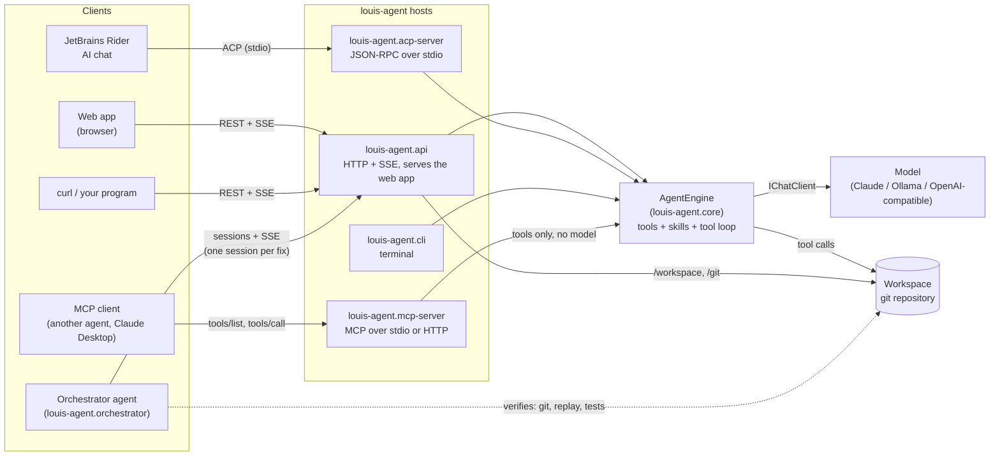
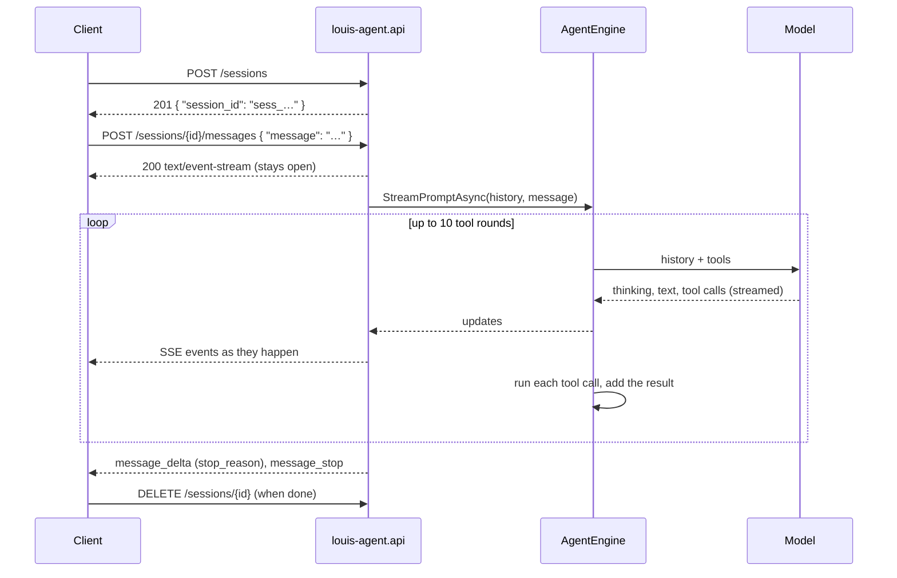
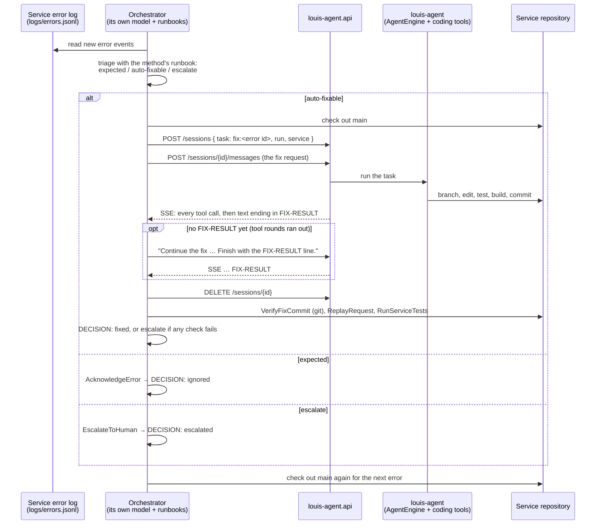

# How the Agents and Endpoints Talk

Who connects to louis-agent, over which protocol, and what goes over the wire — from a browser or Rider, from another
program, and from another agent (the orchestrator). For what happens *inside* one turn (the model, tools and skills),
see [AGENT_INTERACTION.md](AGENT_INTERACTION.md).

## The big picture



Every host is a thin adapter around the same `AgentEngine`: it turns its protocol's input into a prompt and the
engine's streamed output (thinking, text, tool calls, tool results) back into its protocol. The MCP server is the
exception: it has no model of its own and only hands out the tools.

## Which interface to use

| You want… | Use | Why |
|---|---|---|
| To chat with the agent in a browser, review its changes, merge branches | Web app (served by **louis-agent.api**) | Chats, Files, Changes and Branches tabs on top of the API |
| To chat inside Rider | **louis-agent.acp-server** | Rider's AI chat speaks the Agent Client Protocol |
| A program (or another agent) to hand louis-agent a whole task and get the result back | **louis-agent.api** sessions | louis-agent runs its own tool loop server-side and streams what it does; the caller only reads the outcome |
| Another agent to use louis-agent's *tools* with its own model, one call at a time | **louis-agent.mcp-server** | MCP hands out raw tools; the calling agent does all the reasoning |
| Quick prompts in a terminal | **louis-agent.cli** | No network at all |

The difference between the last two matters for agent-to-agent setups. Through the **API**, the other agent delegates:
"fix this", and louis-agent decides how. Through **MCP**, the other agent *is* the brain and louis-agent is a toolbox —
no louis-agent judgement is involved. The orchestrator uses the API, because it wants louis-agent to do the whole fix.

## The HTTP API (louis-agent.api)

Base URL: `http://127.0.0.1:5080` for the main Docker setup, `http://127.0.0.1:5081` for the orchestrator demo. Bound
to `127.0.0.1` only.

**Authentication.** When `AGENT_API_KEY` is set, every `/sessions`, `/workspace` and `/git` call must send it as
`x-api-key: <key>` or `Authorization: Bearer <key>`; otherwise the reply is `401`. `/health` and the web app's own
files never need a key.

**Errors** are JSON in Claude's shape, with a matching status code:

```json
{ "type": "error", "error": { "type": "conflict_error", "message": "This session is still answering a message; …" } }
```

| Status | When |
|---|---|
| `400` | Bad input: empty message, a path outside the workspace, nothing staged to commit, a branch that is already merged |
| `401` | `AGENT_API_KEY` is set and the request didn't send it |
| `403` | The diff of a secret file (`.env`, keys) was asked for |
| `404` | Unknown session or branch |
| `409` | The session is still answering; a merge would conflict (it is aborted); uncommitted changes block a merge |
| `413` / `415` | A workspace file is over 1 MB or binary |

### Sessions: talking to the agent

A session is one conversation with its own history. Sessions live in memory (a restart ends them) and are dropped
after 4 hours idle. One message is answered at a time per session.



| Endpoint | Request | Reply |
|---|---|---|
| `POST /sessions` | Optional `{ "task", "run", "service" }`: tags every usage record of the session (the orchestrator sends `fix:<error id>`, its run id and the service); each at most 200 printable characters | `201 { "session_id", "created_at", "task", "run", "service" }` |
| `POST /sessions/{id}/messages` | `{ "message": "…", "attachments": [{ "name", "content" }] }` | Server-Sent Events (below) |
| `POST /sessions/{id}/cancel` | — | `{ "cancelled": true }`; the stream ends with stop reason `cancelled` |
| `GET /sessions/{id}` | — | `{ "session_id", "created_at", "last_activity", "busy", "task", "run", "service" }` |
| `DELETE /sessions/{id}` | — | `{ "deleted": true }` |

Closing the connection also cancels the reply. A message of `/tools`, `/approve <Name>` or `/reject <Name>` is answered
by the API itself and never reaches the model.

### The event stream

The answer streams as Server-Sent Events shaped like Claude's Messages API. Thinking and text arrive as deltas inside a
block; a tool call and its result each arrive as one whole block. A trimmed real example:

```text
event: message_start
data: {"type":"message_start","message":{"session_id":"sess_2b84…","role":"assistant"}}

event: content_block_start
data: {"type":"content_block_start","index":0,"content_block":{"type":"text","text":""}}

event: content_block_delta
data: {"type":"content_block_delta","index":0,"delta":{"type":"text_delta","text":"Let me read the failing code:"}}

event: content_block_stop
data: {"type":"content_block_stop","index":0}

event: content_block_start
data: {"type":"content_block_start","index":1,"content_block":{"type":"tool_use","id":"toolu_…","name":"ReadWorkspaceFile","input":{"relativePath":"src/OrderService/Api/OrderTotal.cs"}}}

event: content_block_stop
data: {"type":"content_block_stop","index":1}

event: content_block_start
data: {"type":"content_block_start","index":2,"content_block":{"type":"tool_result","tool_use_id":"toolu_…","content":"namespace OrderService; …","is_error":false}}

event: content_block_stop
data: {"type":"content_block_stop","index":2}

event: message_delta
data: {"type":"message_delta","delta":{"stop_reason":"end_turn"}}

event: message_stop
data: {"type":"message_stop"}
```

| Event | Meaning |
|---|---|
| `message_start` | The reply has started |
| `content_block_start` | A new block: `thinking`, `text`, `tool_use` (name and input) or `tool_result` (content, `is_error`) |
| `content_block_delta` | More `thinking_delta` or `text_delta` for the open block |
| `content_block_stop` | The block is complete |
| `message_delta` | The stop reason: `end_turn` or `cancelled` |
| `message_stop` | The stream is complete |
| `error` | The turn failed; the data is the error shape above |

Try it:

```bash
SID=$(curl -s -X POST http://127.0.0.1:5080/sessions | jq -r .session_id)
curl -N -X POST http://127.0.0.1:5080/sessions/$SID/messages \
     -H "Content-Type: application/json" -d '{"message":"What branch am I on?"}'
```

### Workspace and git endpoints

These don't involve the model; the web app uses them to show files and changes and to merge branches. Every path is
checked against the workspace, and secret files are never shown.

| Endpoint | Request | What it does |
|---|---|---|
| `GET /workspace/entries?path=` | — | List a folder |
| `GET /workspace/file?path=` | — | Read a text file (≤ 1 MB) |
| `GET /git/status` | — | Branch and changed files |
| `GET /git/diff?path=&staged=` | — | One file's staged or unstaged diff |
| `POST /git/stage` · `/git/unstage` · `/git/discard` | `{ "paths": [...] }` | Change the index or working tree; returns the new status |
| `POST /git/commit` | `{ "message" }` | Commit what is staged |
| `GET /git/branches` | — | Every branch, with how many commits it is ahead/behind the checked-out branch |
| `GET /git/log?count=` | — | Commits across all branches |
| `GET /git/commit?sha=` | — | A commit and its diff |
| `GET /git/branch?name=` | — | A branch's commits and the diff merging it would bring |
| `POST /git/merge` | `{ "branch" }` | Merge into the checked-out branch (`--no-ff`); a conflict aborts it (`409`) |
| `POST /git/branch/delete` | `{ "branch" }` | Delete a merged branch |
| `GET /health` | — | `{ "status": "ok" }` |

Nothing here pushes: pushing is always left to you.

## The web app and the API

The web app is a Blazor WebAssembly app served by louis-agent.api from the same address, so it calls the API directly.

| Tab | Endpoints it uses |
|---|---|
| Chats | `POST /sessions`, `POST /sessions/{id}/messages` (renders the event stream: thinking, text, tool cards), `/cancel`, `DELETE` |
| Files | `/workspace/entries`, `/workspace/file` |
| Changes | `/git/status`, `/git/diff`, `/git/stage`, `/git/unstage`, `/git/discard`, `/git/commit` |
| Branches | `/git/branches`, `/git/log`, `/git/branch`, `/git/commit`, `/git/merge`, `/git/branch/delete` |

Chats are kept in the browser (`localStorage`); the server only holds the session. In the Branches tab, merges and
deletes are queued: every click is kept and they run one at a time, in order, with each row showing "Merging…",
"Queued" or "deleting…".

## Rider and the ACP server

Rider starts `louis-agent.acp-server` (one container per chat) and talks [Agent Client Protocol](https://agentclientprotocol.com)
JSON-RPC over its stdin/stdout:

| Direction | Message | Meaning |
|---|---|---|
| Rider → agent | `initialize` | Handshake and capabilities |
| Rider → agent | `session/new` | Start a chat (its own history) |
| Rider → agent | `session/prompt` | A message, with attached files as `resource_link` or `resource` blocks |
| Rider → agent | `session/cancel` | Stop the reply |
| agent → Rider | `session/update` | `agent_thought_chunk` (thinking), `agent_message_chunk` (text), `tool_call` and `tool_call_update` (in progress → completed or failed) |

Because stdout carries the protocol, all logging goes to stderr.

## MCP clients and the MCP server

`louis-agent.mcp-server` publishes the engine's tools — files, git, `DotNet*`, scripts, web, skills, agent-built tools
— plus `list_skills`, `get_skill_info` and `get_skill_documentation`. It has no model: the client's own model decides
which tool to call (`tools/list`, `tools/call`), and the tool list updates live (`notifications/tools/list_changed`).

| Transport | For | Auth |
|---|---|---|
| stdio (default) | A local client that starts the server as a subprocess (Rider, Claude Desktop) | None needed: only the parent process can talk to it |
| Streamable HTTP (`MCP_TRANSPORT=http`, port 5090) | A remote client, e.g. an agent built on another SDK | `MCP_API_KEY` (falls back to `AGENT_API_KEY`); without a key it only logs a warning |

Approving agent-built tools is never possible over MCP: that stays with the user.

## Agent to agent: the orchestrator and louis-agent

The orchestrator ([samples/README.md](../samples/README.md)) is a second agent built on `louis-agent.core`. It reads a
service's error log, decides what each error needs from a runbook per API method ([RUNBOOKS.md](RUNBOOKS.md)), and has
louis-agent fix the ones the runbook allows — over the same session API any client uses. It then checks louis-agent's work itself.



### The messages between them

All of it is plain text in the session's messages; the structure comes from fixed formats both sides agree on.

**1. The error event** — what the service logged, one JSON line per exception. It is untrusted (it can contain user
input), so it is always fenced and labelled as data, never instructions:

```json
{ "id": "e8b0b572223d", "service": "order-service", "method": "order-total", "arguments": "1003",
  "exception_type": "System.Collections.Generic.KeyNotFoundException",
  "message": "The given key 'SUMMER25' was not present in the dictionary.",
  "stack_trace": "   at OrderService.OrderApi.GetOrderTotal(Int32 id) in /demo/order-service/src/OrderService/Api/OrderTotal.cs:line 18 …" }
```

**2. The fix request** (orchestrator → louis-agent, built by `ServiceTools.FixPrompt`): the fenced event, the expected
behaviour taken from the runbook, and fixed steps — branch `fix/<method>-<error id>` from `main`, the smallest change,
a regression test in a new file, build and test, commit (never push or merge), then end with a `FIX-RESULT` line.

**3. The result line** (louis-agent → orchestrator), the last line of its reply:

```text
FIX-RESULT: {"status":"fixed","commit":"9375e0a","branch":"fix/order-total-e8b0b572223d","tests":"15/15 passed","summary":"…"}
FIX-RESULT: {"status":"failed","reason":"…"}
```

**4. The follow-up**, when a reply ends without a `FIX-RESULT` (louis-agent has 10 tool rounds per message, and a fix
usually needs more): `Continue the fix from where you stopped. Finish with the FIX-RESULT line.` The session keeps the
context, so louis-agent carries on where it stopped. The orchestrator sends up to three.

**5. The decision** (the orchestrator's own model, last line of its triage):
`DECISION: <fixed|ignored|escalated|failed> - <one sentence>`.

### Trust: a claim is not proof

The `FIX-RESULT` is louis-agent's claim. The orchestrator only reports `fixed` after its own checks pass:

| Check | How |
|---|---|
| `VerifyFixCommit` | In git: the commit exists, is on the reported branch, which is checked out and starts from the tip of `main`; it is not on `main`; it changed files; the working tree is clean |
| `ReplayRequest` | Runs the failing API call again on the fix branch: it must answer `200` |
| `RunServiceTests` | The whole test suite, including louis-agent's regression test, must pass |

Each agent also only has the tools its role needs: louis-agent has the coding tools but no access to the error tracker
or deployments; the orchestrator has no file, git-write or shell tools — it can only ask louis-agent, check, acknowledge
or escalate. A human merges the fix branches (in the web app's Branches tab).

### Where the conversation is recorded

Everything the two agents say is written to one Markdown file, `agent-comms.md`: per error, each message the
orchestrator sent (verbatim), each reply (a table of louis-agent's tool calls, its text and the `FIX-RESULT`), the
orchestrator's checks, and a summary — ending with a run summary table. A real one from a demo run is in
[samples/sample-output/agent-comms.md](../samples/sample-output/agent-comms.md); a shortened excerpt:

```text
## 2/13 · `order-total 1003` · KeyNotFoundException
### Orchestrator → louis-agent · message 1        (the fix request)
### louis-agent → orchestrator · reply 1 · 12 tool call(s)
| 4 | CreateBranch  | {"branchName":"fix/order-total-e8b0b572223d"} | Success (no output). |
| 11 | WriteWorkspaceFile | {"relativePath":"src/OrderService/Api/OrderTotal.cs", …} | Wrote … |
FIX-RESULT: none in this reply
### Orchestrator → louis-agent · message 2        Continue the fix from where you stopped. …
### louis-agent → orchestrator · reply 2 · 6 tool call(s)
| 2 | DotNetTest | {"project":"OrderService.slnx"} | Passed! - Failed: 0, Passed: 15 … |
| 5 | Commit     | {"message":"fix(order-total): handle unknown discount codes gracefully …"} | [fix/order-total-… 9375e0a] … |
FIX-RESULT: status fixed · commit 9375e0a · branch fix/order-total-e8b0b572223d · tests 15/15 passed
### Orchestrator actions and checks
- VerifyFixCommit(9375e0a, fix/order-total-e8b0b572223d) → VERIFIED
- ReplayRequest(order-total 1003) → 200 order-total 1003: 35.00
- RunServiceTests → Passed! - Failed: 0, Passed: 15
### Summary   Decision: fixed
```

The orchestrator also keeps machine-readable records next to it (`decisions.jsonl`, `fixes.jsonl`,
`escalations.jsonl`, `acknowledged.jsonl`), and louis-agent.api logs every tool call it ran.

---
[Docs index](README.md) · Previous: [How a turn works](AGENT_INTERACTION.md) · Next: [Architecture](ARCHITECTURE.md)
