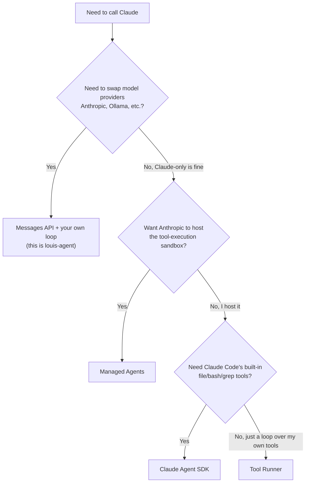
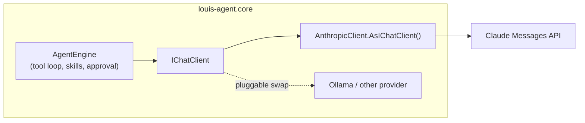

# Louis Agent: Development Guide

## How to work with Louis

Louis is a software engineer learning to become an AI engineer through this project; learning matters more than speed.
The goal and the skill map are in [GOAL.md](GOAL.md).

1. **Louis drives the code.** Implement only what Louis asks for, one step at a time; planning, reviews and learning
   write-ups happen in the Claude project, so don't start the next feature on your own.
2. **Small steps.** Follow the steps in the feature doc. Each step is one commit (or PR) with its test, small enough to
   review in about ten minutes.
3. **Explain every change:** what changed, why this design and not the alternatives, and what to look at closely.
4. **Stop after each step** and wait for Louis to review and understand it before starting the next one.
5. **Teach, don't just do.** Name the AI-engineering concept behind each step and where it sits in the GOAL.md skill map.
6. **Measure, don't assume.** Ask before anything that spends real money (benchmark or demo runs against the API) and
   before pushing.
7. **Write it up.** When a skill or feature finishes, help write its learning write-up in [learning/](learning/).
8. **Source of truth:** [TODO.md](../TODO.md) (what's next), [features/](features/README.md) (how), [fixes/](fixes/README.md)
   (what broke and why) and [specs/](specs/) (why). Update them rather than duplicating them.

## Quick start

```bash
cp config/.env.example config/.env
cp config/.env.secrets.example config/.env.secrets   # add ANTHROPIC_API_KEY
dotnet build louis-agent-solution.sln
dotnet test tests/louis-agent.core.tests
dotnet run --project src/louis-agent.cli               # interactive CLI
```

Docker (web app + API on http://127.0.0.1:5080):

```bash
docker compose -f docker/docker-compose.yml --env-file config/.env up -d --build api
```

Always pass `--env-file config/.env`; compose needs it for `REPOSITORIES_PATH`. Requires the .NET 10 SDK.

## Project structure

One design doc per project — purpose, structure, key types, settings, extension points, tests and limits — is in
[projects/](projects/README.md).


```
louis-agent.core/
├── AgentHost.cs              # Bootstrap for every host: env files, options, skills, LLM client, engine, logging
├── AgentLog.cs               # File logging (LOG_DIRECTORY): stderr copy per run + JSONL records
├── MarkdownSkillLoader.cs    # Parses "## Skill:" procedures from markdown
├── config/
│   ├── LlmOptions.cs         # LLM_* settings, tool-support and thinking resolution
│   └── AgentOptions.cs       # Workspace, skills, keys, Rider MCP, LOG_DIRECTORY, USAGE_LEDGER
├── providers/
│   ├── LlmClientFactory.cs   # Provider → IChatClient (Anthropic thinking-budget wrapper lives here)
│   ├── CompositeSkillProvider.cs, MarkdownSkillProvider.cs, ISkillProvider.cs
│   └── Personality/Default/DotNet/DevOps/Paymo/CodeReview/TimeLogging SkillsProvider.cs
├── tools/
│   ├── AgentEngine.cs        # Tools, system prompt, streaming turn loop, tool-result guards, /approve commands
│   ├── WorkspaceTools.cs     # Files; ResolvePath/IsSensitive are internal and reused by the API
│   ├── GitTools.cs, DotNetTools.cs, PythonTools.cs, PowerShellTools.cs, BashTools.cs
│   ├── WebTools.cs, WebSearchProviders.cs   # WebSearch (Google / DuckDuckGo) and FetchUrl (SSRF-guarded)
│   ├── PaymoTools.cs, DevOpsTools.cs        # Loaded only when their API keys are set
│   ├── ScriptTool.cs         # Agent-built tools (*.tool.md)
│   └── ProcessRunner.cs      # Process runner: argument lists, no shell, timeouts
├── usage/                    # Usage ledger (F1): one JSON line per model request in {LOG_DIRECTORY}/usage-YYYY-MM.jsonl
│   ├── UsageRecordingChatClient.cs  # Middleware inside the tool loop: records each request, streaming or not
│   ├── UsageScope.cs         # Per-turn context (AsyncLocal): host, session, turn, purpose, task/run/service tags
│   ├── IUsageMapper.cs       # Provider usage → the ledger's token kinds (Standard / Anthropic mappers)
│   ├── PriceTable.cs, CostCalculator.cs  # Prices (config/prices.json) and a record's cost (F2)
│   ├── PricingUsageSink.cs   # Puts the cost on each record before the ledger writes it
│   └── UsageRecord.cs, IUsageSink.cs, JsonlUsageSink.cs
└── mcp/
    ├── RiderMcpClient.cs     # Lists tools from Rider's MCP server
    └── RiderMcpToolDiscovery.cs

src/
├── louis-agent.cli/          # Terminal host
├── louis-agent.acp-server/   # Rider (Agent Client Protocol over stdio)
├── louis-agent.api/          # Minimal API: sessions + SSE, /workspace, /git; serves the web app
│   ├── Program.cs, AgentSessions.cs, WorkspaceEndpoints.cs
│   ├── GitEndpoints.cs       # status, diff, stage/unstage/discard, commit
│   └── HistoryEndpoints.cs   # branches, log, commit/branch diffs, merge, delete merged branch
├── louis-agent.web/          # Blazor WebAssembly app (chat, Files, Changes, Branches, themes)
│   ├── Pages/ChatPage.razor, Components/*.razor, Services/*.cs
│   └── wwwroot/css/app.css + css/themes/*.css + themes.json
├── louis-agent.mcp-server/   # Publishes the toolset over MCP (no LLM) - stdio by default, MCP_TRANSPORT=http for remote clients
└── louis-agent.orchestrator/ # POC: watches a service's errors, runbook per API method, delegates fixes to louis-agent.api
    ├── Program.cs            # poll loop: triage each error event with an AgentEngine (own toolset, runbooks as skills)
    ├── ServiceTools.cs       # its only tools: CallLouisAgentFix, VerifyFixCommit, ReplayRequest, RunServiceTests, Escalate/Acknowledge
    ├── LouisAgentClient.cs   # louis-agent.api sessions + SSE parsing, FIX-RESULT
    ├── CommsLog.cs           # Markdown log of every message between the agents
    └── Skills/               # orchestrator.md + {service}/service.md + one runbook per API method

tools/louis-agent.usage-probe/ # Prints a provider's raw token usage and the ledger's mapping (calls the real provider)
tests/louis-agent.core.tests/ # NUnit; Config, Loaders, Providers, Tools, mcp
tests/louis-agent.orchestrator.tests/ # NUnit; error feed, SSE client, verification tools
samples/                      # order-service (demo microservice) + run-demo.ps1, see samples/README.md
docker/                       # Dockerfile.{acp-server,api,agent,mcp-server,orchestrator}, docker-compose.yml,
                              # docker-compose.demo.yml (orchestrator demo); the build context's .dockerignore is at the repo root
config/                       # .env and .env.secrets (both ignored), their examples, LLM profiles (.env.anthropic,
                              # .env.ollama), prices.json (model prices), Rider config examples
Skills/                       # personality.md + default.md + *-skills.md (system prompt), tools/ (agent-built tools)
docs/                         # This guide and the other docs
```

## Development workflow

### Adding a C# tool

1. Add a public method with `[Description]`s to a tool class (or a new class in `louis-agent.core/tools/`):

   ```csharp
   [Description("What this tool does")]
   public string MyTool([Description("What the parameter is")] string input, int limit = 10) => "result";
   ```

2. For a new class, register it in the `AgentEngine` constructor: `AddPublicMethodsAsTools(new MyTools(WorkspaceRoot));`
3. Mention it in the relevant `Skills/*.md` so the model knows when to use it.
4. Test it in `tests/louis-agent.core.tests/Tools/`.

**Every public method on a tool class becomes a tool.** Helpers must be `internal` or `private` (the test project and
`louis-agent.api` can see internals). Tool names must be unique across all classes.

Return strings the model can act on: say what went wrong and what to do instead. Keep output bounded — results over
50,000 characters get summarised; most toolsets cap their own output at 12,000.

### Adding a skill

Create `Skills/{name}-skills.md`. With `AGENT_FUNCTION=louis` every skill file is loaded; otherwise set
`AGENT_FUNCTION={name}`. For a guide that must always load (like `bash-skills.md`), add it to
`AgentHost.AlwaysLoadedSkillFiles` and `BuiltInSkillFiles`. Procedures use `## Skill: Name` with an `Execution:` fence
(bash, powershell or python); arguments arrive as `SKILL_ARG_*` environment variables.

### Building another agent on core

Pass `toolsets:` to the `AgentEngine` constructor to give an agent only your tool objects (plus `ExecuteSkill`) instead
of the built-in coding tools, and build its system prompt from your own skill files (`CompositeSkillProvider` +
`MarkdownSkillProvider`). `louis-agent.orchestrator` does exactly this; its `Program.cs` is the example.

### Adding a web theme

Copy `src/louis-agent.web/wwwroot/css/themes/paper.css` to `{id}.css`, set the variables listed at the top of
`css/app.css`, and add `{ "id": "{id}", "name": "…" }` to `themes.json`. Ids are lowercase letters, digits and dashes.

### Changing the LLM

Configuration only — see [MODELS.md](MODELS.md). Provider differences belong in `LlmClientFactory`, never in
`AgentEngine` or the tools.

### Running and debugging

- Tool calls are logged to stderr: `[TOOL] -> Name(args)` and `[TOOL] <- Name: result` (or `failed: …`).
- In Docker, logs persist in `logs/`; `docker logs louis_agent_api` shows the API.
- Write debug output to `Console.Error`, never `Console.Out`: stdout carries the ACP and MCP protocols.
- After changing the web app or API, rebuild the `api` image; after changing core, rebuild every image you use. Rider
  chats keep their container until you start a **New Chat**.

### Tests

```bash
dotnet test tests/louis-agent.core.tests
dotnet test tests/louis-agent.core.tests --filter "FullyQualifiedName~AgentEngineTests"
dotnet test tests/louis-agent.orchestrator.tests
```

Tests use `FakeChatClient` (a scripted `IChatClient` that also streams) and `StubHandler` for HTTP — no network, model or
Docker. A few tests skip themselves when git, pip or the network isn't available. The agent runs tests on Linux inside
its containers, so keep them platform-neutral (forward slashes, no Windows-only paths).

The API and web app have no automated tests yet; check them by hand (curl and a browser) after changes. The
orchestrator demo (`samples/run-demo.ps1`, in Docker; see [samples/README.md](../samples/README.md)) exercises the
whole loop against a real model: API sessions, the fix flow, and the web app's Branches view.

## Key design decisions

- **Microsoft.Extensions.AI** — one `IChatClient` across providers; `FunctionInvokingChatClient` runs the tool loop.
- **Streaming everywhere** — hosts render `StreamPromptAsync` updates; the finished turn is appended to the history,
  thinking blocks included (Anthropic requires them when continuing after tool calls).
- **Arguments as data** — skill and tool arguments travel as environment variables or argument lists, never through a
  shell, so model text can't become commands.
- **Guard the context** — oversized results are summarised, cut-off calls are never run, failures carry their reason.
- **Hosts stay thin** — each host maps the same stream to its protocol; behaviour lives in core.

## Anthropic integration tiers (reference)

Four ways to build on Claude, from most managed to least. `louis-agent` deliberately sits at the bottom tier — see
"Why `louis-agent` uses the Messages API tier" below.

| Tier | Who hosts the loop | Who hosts the sandbox/tools | OpenAI equivalent |
|---|---|---|---|
| **Messages API** (`POST /v1/messages`) | You | You | Responses API |
| **Tool Runner** (`client.beta.messages.tool_runner`, Anthropic SDK only) | SDK | You | Agents SDK (partial — Anthropic-only, no handoffs/multi-agent) |
| **Claude Agent SDK** (`claude-agent-sdk`, separate package — Claude Code as a library) | SDK | You | Agents SDK (closer — ships built-in coding tools) |
| **Managed Agents** (beta, Anthropic-hosted) | Anthropic | Anthropic | Agents API |

### Decision tree



### Real-world use cases

- **Messages API + your own loop** (what this repo uses): multi-provider portability is a hard requirement, or you
  need custom session/approval/skill semantics a vendor SDK doesn't model. `louis-agent`'s `IChatClient`
  abstraction lets `LlmClientFactory` swap Anthropic for Ollama without touching `AgentEngine` or any tool.
- **Tool Runner**: a single-provider (Claude-only) shop building a straightforward custom-tool agent — e.g. an
  internal ticket-triage bot — that wants approval-gate/logging/retry hooks without hand-writing the
  `while stop_reason == "tool_use"` loop.
- **Claude Agent SDK**: a coding/filesystem-centric agent (a Cursor/Devin-style assistant, a PR-review bot) where
  Claude Code's built-in Read/Write/Edit/Bash/Grep tools already cover the surface you need, and being Claude-only
  is acceptable. Reinventing `WorkspaceTools`/`BashTools` wouldn't have been worth it here either, if this repo
  didn't also need DevOps/Paymo tools, markdown-defined skills, and provider portability on top.
- **Managed Agents**: you don't want to run a sandbox at all — a SaaS feature ("AI cleans up your spreadsheet"), a
  nightly scheduled agent (no cron box of your own to maintain), or persisted/versioned agent configs shared
  across teams with no platform/ops capacity to host it themselves.

### Why `louis-agent` uses the Messages API tier

Both higher tiers trade away something this repo depends on:

- **Managed Agents** would mean Anthropic hosts the tool-execution sandbox — incompatible with owning the Docker
  containers, repo mounts, and scoped DevOps/Paymo credentials this repo runs with (see the `IsSensitive` file
  blocking and the tool-approval flow in `AgentEngine`).
- **Tool Runner and Claude Agent SDK** are both Anthropic-specific packages — picking either locks every model call
  to Claude, which conflicts with the `IChatClient` provider abstraction (`LlmClientFactory`) this repo is built
  around.



### MCP exposes tools, not a model

`louis-agent.mcp-server` hands an *external* client's model the raw tools, one call at a time; it has no model of its
own, so `AgentEngine` never calls its own tools through it. To have louis-agent do a whole task and report back (as the
orchestrator does), call `louis-agent.api`'s session endpoint instead. `MCP_TRANSPORT=http` serves MCP over the network
and needs `MCP_API_KEY` (falls back to `AGENT_API_KEY`). The full comparison, both transports and the agent-to-agent
flow are in [AGENT_COMMUNICATION.md](AGENT_COMMUNICATION.md).

## Known limitations

The same list as the TODO's *Known limitations*: when work removes one, delete it in both places (see
[Finishing a feature](features/README.md#finishing-a-feature)).

1. **Rider MCP discovery only logs** Rider's tools; they aren't callable yet (needs a full MCP client).
   Removed by a full MCP client (TODO *Agent architecture gaps: Protocols*, backlog).
2. **Sessions are in memory** in the API and ACP server; a restart ends them (the web app keeps the transcript).
   Removed by durable sessions ([session architecture](specs/SESSION_ARCHITECTURE.md), backlog).
3. **Ollama tool support is a name heuristic** (`LlmOptions.KnownNoToolsPrefixes`).
4. **Paymo task lookup takes the first match** for a name; ambiguous names can hit the wrong task.
5. **No rate limiting or audit log** beyond the file logs. Removed by TODO *Agent architecture gaps: Safety* (backlog).
6. **10 tool rounds per message** (`MaximumIterationsPerRequest`): a long task stops mid-way and needs a follow-up
   message to continue. The orchestrator does this automatically ("Continue the fix…"); most demo fixes take 2-3 messages.
   Removed by [F10 Route settings](features/F10-route-settings.md).
7. **Running the API with `dotnet run` (unpublished)** only serves the web app in the `Development` environment
   (`ASPNETCORE_ENVIRONMENT=Development`); otherwise `/` returns 404. The Docker images are published, so they're fine.
8. **Local models get a truncated prompt.** Ollama's context window is 2,048 tokens by default and the agent sends
   ~26,000+ (system prompt and tools); Ollama drops the rest without an error, so the ledger shows `input: 2050`.
   Removed by [F13 Local models](features/F13-local-models.md).
9. **Reloading skills or approving a tool mid-chat can break the chat on Claude Haiku 5.5** (the default). The model
   rejects a changed system prompt or tool list once thinking blocks are in the history (enforced for accounts created
   on or after 2026-08-31), and `BeginTurn` rewrites the system prompt after a reload. Start a new chat afterwards.
   Removed by [FX4 Append-only history](fixes/FX04-append-only-history.md).

## Common errors

- **"ANTHROPIC_API_KEY (or LLM_API_KEY) is required for provider 'anthropic'"** — set it in `config/.env.secrets`.
- **"prompt is too long"** — something put a huge result into the history; check `logs/oversized-tool-results.jsonl`.
- **"adaptive thinking is not supported on this model"** — a pre-4.6 Claude model not listed in
  `LlmClientFactory.ThinkingBudgetModelPrefixes`; add its prefix.
- **Skill not found** — the file isn't loaded for this `AGENT_FUNCTION`, or the name differs (case-sensitive).
- **bash not found on Windows** — install Git for Windows or set `BASH_PATH` to `bash.exe`; WSL's bash is never used.

## Contributing

Branch off `main`, keep changes focused, run `dotnet build` and `dotnet test`, and write commit messages that explain
why. See [ARCHITECTURE.md](ARCHITECTURE.md) for the design, `config/.env.example` for settings, and
[Skills/default.md](../Skills/default.md) for how the agent is instructed to behave.

---
[Docs index](README.md) · Previous: [Architecture](ARCHITECTURE.md) · Next: [Orchestrator demo](../samples/README.md)
