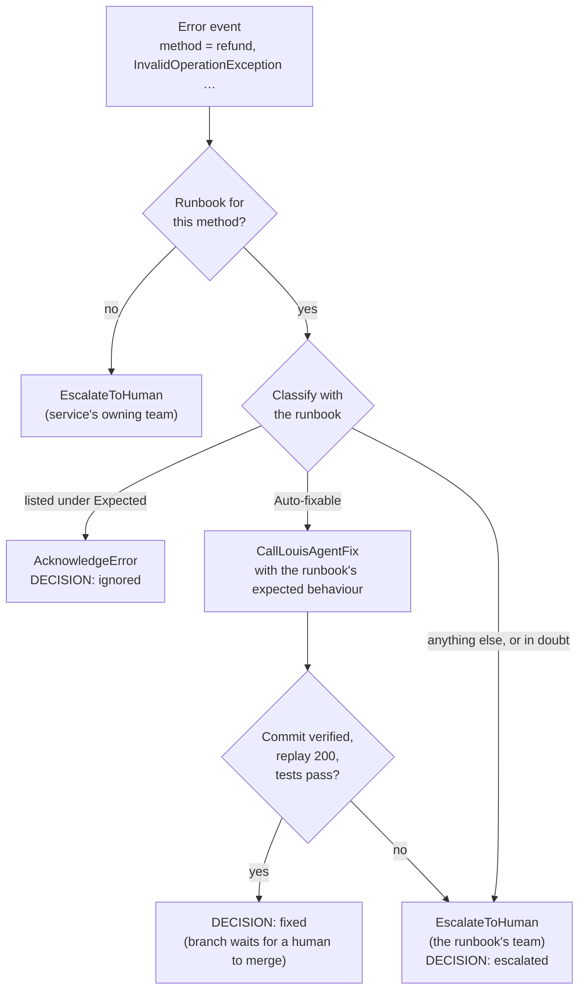

# Runbooks: How the Orchestrator Decides

A **runbook** is the orchestrator's instruction sheet for one API method of the service it watches. When that method
throws, the orchestrator reads its runbook to decide what happens: nothing, a fix by louis-agent, or a hand-off to a
human team. Runbooks are where people set the policy; the agents carry it out.

## The term

"Runbook" comes from IT operations and SRE: the written procedure for handling a particular alert — what it means,
what's normal, what to do, and whom to call when that doesn't work — so whoever is on call doesn't have to work it out
under pressure. ("Playbook" is a near-synonym.) Here the one following the runbook is the orchestrator's model instead
of an on-call engineer.

In the code, runbooks are **skills**: the orchestrator loads them with the same mechanism louis-agent uses for its
skill files (`MarkdownSkillProvider`) into its system prompt. They are guidance only — no `## Skill:` procedures to
run. "Skill" names the mechanism; "runbook" names what these skills are for.

## Where they live

```
src/louis-agent.orchestrator/Skills/
├── orchestrator.md            the workflow every error goes through (the same for all services)
└── order-service/             one folder per watched service, selected with ORCHESTRATOR_SERVICE
    ├── service.md             the service: what it does, owning teams, deploy and payments policy
    ├── order-total.md         one runbook per API method …
    ├── refund.md
    └── …                      (11 in the demo)
```

The file name is the method name the service's error events carry: `order-total.md` covers errors whose `method` is
`order-total`. The orchestrator only replays requests for methods that have a runbook, and an error from a method
without one goes straight to a human.

## What a runbook contains

| Section | Answers | What the orchestrator does with it |
|---|---|---|
| `## Method: <name>` | Which method this covers | Matches the runbook to the error |
| **What it does** | What the method is for, where its code is | Background for deciding; "this moves money" marks a method as high-risk |
| **Data note** *(optional)* | Facts about the data the code must cope with | Background, and context louis-agent gets indirectly through the expected behaviour |
| **Expected** | Exceptions that are normal behaviour (a 404, a correctly rejected request) | `AcknowledgeError` — no action |
| **Auto-fixable** | Exceptions that are bugs an agent may fix — or "nothing" | `CallLouisAgentFix`, then the orchestrator verifies the fix itself |
| **Expected behaviour for louis-agent** | What *correct* behaviour is, as a business rule with examples | Sent verbatim to louis-agent inside the fix request |
| **Escalate to** | Which team gets everything else, and when a fix isn't confirmed | `EscalateToHuman` |

## How a runbook is used

For every new error, the orchestrator follows `orchestrator.md`:



Classification matches on the exception **type** and, where the runbook says so, the **message**. When in doubt, the
orchestrator escalates — a wrongly escalated error costs a person a minute; a wrongly "fixed" one can cost much more.

## Two examples

### A method that is never fixed: `refund.md`

```markdown
## Method: refund

**What it does:** `POST /orders/{id}/refund` — refunds the order's total to the card it was paid with
(`payment_ref`) and marks it refunded (`Api/Refund.cs`). This moves money.

**Expected (acknowledge, no action):**
- `System.InvalidOperationException` with a message containing "already been refunded" — a duplicate refund
  request was correctly rejected.
- `OrderService.OrderNotFoundException` — unknown order id (a 404).

**Auto-fixable:** nothing. Payments code is never changed by an agent.

**Escalate to:** payments — every other exception, with the exception type, message and order id, so they can
check whether the customer was refunded.
```

In the demo run:

| Error | Matches | Decision |
|---|---|---|
| `refund 1002` — `InvalidOperationException` "Order 1002 has already been refunded" | Expected | **ignored** |
| `refund 1005` — `ArgumentOutOfRangeException` (the order has no card reference) | nothing, and nothing is auto-fixable | **escalated** to payments |

The second one is a genuine bug that looks easy to fix. The runbook still says no, so a person checks whether the
customer got their money before anyone touches payment code.

### A method that is fixed: `order-total.md`

```markdown
## Method: order-total

**What it does:** `GET /orders/{id}/total` — the amount to charge: the subtotal minus the order's discount code,
rounded to 2 decimals (`Api/OrderTotal.cs`). The checkout calls it before taking payment, so a failure blocks the sale.

**Discount codes in force:** `WELCOME10` (10%), `VIP20` (20%). Marketing retires codes without telling engineering, so
orders can carry a code that is no longer in the table.

**Expected (acknowledge, no action):**
- `OrderService.OrderNotFoundException` — unknown order id (a 404).

**Auto-fixable:** any other exception — for example a `KeyNotFoundException` for a retired discount code.

**Expected behaviour for louis-agent:** an unknown or retired discount code gives no discount (the total is the
subtotal) instead of failing. Totals for orders with `WELCOME10`, `VIP20` or no code must not change.

**Escalate to:** orders — if the fix is not confirmed, or would change the total of an order with a valid code.
```

`order-total 1003` threw a `KeyNotFoundException` for the retired code `SUMMER25`. The runbook calls that
auto-fixable, so the orchestrator sent louis-agent the expected behaviour line word for word. louis-agent changed the
lookup to return the subtotal for unknown codes, added a regression test, and committed on its own branch; the
orchestrator verified the commit, replayed the request (`200 … 35.00`) and ran the tests before deciding **fixed**.

Note what the runbook decided and what it left to louis-agent: *that* a retired code gives no discount is a business
rule, written down by a person; *how* the code does it is louis-agent's job.

## Writing a good runbook

- **State correct behaviour as a rule with examples**, not as a code change. "An unknown code gives no discount" lets
  louis-agent find the right fix; "use `TryGetValue`" assumes you already know the cause.
- **Say what must not change.** "Totals for orders with `WELCOME10`, `VIP20` or no code must not change" keeps a fix
  from quietly altering correct results.
- **Use an example to rule out the wrong reading.** The first `customer-initials` runbook said only that a single name
  gives one initial; louis-agent's fix then took the first letter of *every* word. Adding "`Mary Ann Smith` → `MS`
  (not `MAS`)" fixed it on the next run — no code change, just a clearer runbook.
- **Name exceptions precisely** under Expected: the type, and the message when the type alone is too broad
  (`InvalidOperationException` covers far more than duplicate refunds).
- **Keep risky methods out of Auto-fixable.** Anything that moves money, deletes data or talks to another company
  should escalate. Say so in plain words, as `refund.md` does.
- **Put shared facts in `service.md`** (owning teams, deploy policy) and method-specific facts in the method's runbook.
- **Don't put secrets in a runbook.** It is part of a model prompt and is logged in the agent communications log.

## Template

```markdown
## Method: <method-name>

**What it does:** `<HTTP verb and route>` — <what it returns or changes, and why it matters> (`<file>`).

**Data note:** <facts about the data the code must cope with> (optional)

**Expected (acknowledge, no action):**
- `<Namespace.ExceptionType>` — <why this is normal, e.g. unknown id (a 404)>.

**Auto-fixable:** <which exceptions an agent may fix> — or: nothing. <why>

**Expected behaviour for louis-agent:** <the correct behaviour as a rule, with examples, and what must not change>

**Escalate to:** <team> — <when: everything else, or a fix that isn't confirmed>.
```

## Adding and changing runbooks

- **A new method:** add `Skills/<service>/<method>.md` from the template. Its file name must be the method name the
  error events carry.
- **A new service:** add `Skills/<service>/service.md` and the method runbooks, and run an orchestrator with
  `ORCHESTRATOR_SERVICE=<service>`, pointed at that service's own louis-agent.api.
- **After a change:** runbooks are copied into the orchestrator's build, so rebuild it — in the demo,
  `.\samples\run-demo.ps1` rebuilds the images. The next triage uses the new text. `agent-comms.md` shows what the
  orchestrator decided and what it sent louis-agent, which is the quickest way to check a runbook says what you meant.

---
[Docs index](README.md) · Previous: [Orchestrator demo](../samples/README.md) · Next: [Sample output](../samples/sample-output/README.md)
