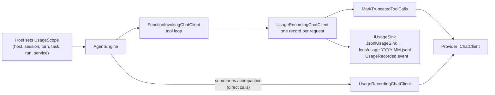

# F1 · Usage ledger: record every model request

> **Status:** in progress · **Milestone:** M1 · **Depends on:** —
>
> **Spec:** [Usage §4.1, §4.3](../specs/USAGE_AND_BUDGETS.md) · [Optimisation §A](../specs/RESPONSE_OPTIMISATION.md)
>
> **In the TODO:** tick **F1 Usage ledger** under *Now* ([TODO](../../TODO.md))

Today `ChatResponse.Usage` is ignored everywhere, so nobody knows what a turn, a fix or a run used. F1 records one line per
model request, attributed to who made it and what for. Every other feature in this plan reads from it.

## User stories

**F1-S1 — Record every request.** As an *operator*, I want every model request recorded with its token counts, so that I
can see where tokens go.
- *Given* any host (CLI, Rider, API, orchestrator) *when* a model request completes *then* one line is appended to
  `logs/usage-YYYY-MM.jsonl` with input, cache-write, cache-read, output and reasoning tokens, model, duration and stop
  reason.
- *Given* a turn with 7 tool rounds *when* it finishes *then* there are 7 records, numbered `round` 1–7.
- *Given* an oversized tool result is summarised *then* the summary call is recorded with `purpose: "summary"`.
- *Given* a provider that reports no counts *then* the counts are `null`, never 0.

**F1-S2 — Know who and what for.** As an *operator*, I want each record attributed to host, session, turn and purpose,
so that I can total it any way I need.
- *Given* a web chat *then* its records carry `host: "api"`, the session id and the turn number.
- *Given* the model is asked to continue after a cut-off reply *then* that request is `purpose: "continue"`.

**F1-S3 — Attribute fixes and runs.** As an *operator* of the orchestrator, I want a fix's usage tagged with its error id
and run, so that a run's cost includes both agents.
- *Given* the orchestrator opens a session for error `e8b0…` in run `R` *then* every louis-agent record of that session
  has `task: "fix:e8b0…"`, `run: "R"`, `service: "order-service"`.
- *Given* the orchestrator triages *then* its own records have `purpose: "triage"` and the same run id.

**F1-S4 — Safe to keep.** As a *developer*, I want the ledger to contain no prompt text or tool output, so that it can be
kept and shared without leaking code or data.
- *Then* a record holds only counts, ids, names, timings and the stop reason.

## Design

New, in `louis-agent.core/usage/`:

| Type | Responsibility |
|---|---|
| `UsageRecord` | The record in U §4.1 (immutable `record`); `Tokens` with nullable counts; `Cost` filled by F2 |
| `UsageScope` | Ambient context (`AsyncLocal`) a host opens per turn: host, session, turn, purpose, task, run, service; tracks the round counter |
| `UsageRecordingChatClient` | `DelegatingChatClient`. Non-streaming: reads `ChatResponse.Usage`. Streaming: collects the `UsageContent` items from the updates (Anthropic sends one, in the last update). Maps `UsageDetails` through the provider's `IUsageMapper`. Writes one `UsageRecord` per request |
| `IUsageMapper` | Maps `UsageDetails` to the four non-overlapping kinds. `StandardUsageMapper` follows the Microsoft.Extensions.AI contract (cached tokens are part of `InputTokenCount`, so `input` = `InputTokenCount − cache reads − cache writes`); `AnthropicUsageMapper` also reads cache writes from `AdditionalCounts["CacheCreationInputTokens"]`. `LlmClientFactory.CreateUsageMapper` picks one per provider |
| `IUsageSink` / `JsonlUsageSink` | Appends records via `AgentLog` to a monthly file; raises `UsageRecorded` for hosts that show live totals (F3) |

Where it plugs in:

- **`AgentEngine` constructor:** add `UsageRecordingChatClient` in the same inner position as
  `MarkTruncatedToolCallsAsync` (inside `UseFunctionInvocation`), so it sees each request of the tool loop. Wrap
  `_innerChatClient` too, so `SummariseToolResultAsync` is recorded (purpose `summary`).
- **`StreamPromptAsync` continuation:** set `purpose: "continue"` on the scope before each cut-off continuation.
- **Hosts open a scope per turn:** API `StreamTurnAsync` (`host: api`), ACP `AcpServer` prompt handler (`acp`),
  `AgentEngine.RunAsync` / `RunSinglePromptAsync` (`cli`), orchestrator triage (`orchestrator`, `purpose: triage`).
- **Session tags (S3):** `POST /sessions` accepts an optional body `{ "task", "run", "service" }`, stored on
  `AgentSession` and applied to every turn's scope. `LouisAgentClient.CreateSessionAsync` sends them; the orchestrator
  creates a run id at start (`run-yyyyMMdd-HHmmss`).
- **Settings:** `USAGE_LEDGER` (`on`/`off`) in `AgentOptions`; the file goes to `LOG_DIRECTORY` (no ledger without it,
  with a warning).

## Implementation steps

1. **Spike — what the adapter reports.** Log `UsageDetails` (all properties, and every `AdditionalCounts` key) for one
   streaming and one non-streaming Anthropic request with caching off and on. Record which key holds cache writes in
   the optimisation spec's open questions. *No production code.* **Done:** cache writes are
   `AdditionalCounts["CacheCreationInputTokens"]`, `InputTokenCount` includes cached tokens, reasoning is null, and
   streaming usage arrives in the last update (optimisation spec, *What the Anthropic adapter reports*).
2. **`UsageRecord` and `UsageScope`.** *Test:* nested scopes restore the outer one; the round counter increments per
   request and resets per turn; scope values flow across `await`.
3. **`UsageRecordingChatClient`, non-streaming.** *Test:* with `FakeChatClient` returning `UsageDetails`, one record
   with the right counts and scope; `null` counts stay `null`; Anthropic-shaped usage (input 10,266, cached 10,227)
   records `input` 39 and `cache_read` 10,227.
4. **Streaming support.** *Test:* a fake stream carrying `UsageContent` produces one record when the stream ends;
   a cancelled stream records what was reported so far, with `stop: "cancelled"`.
5. **Wire into `AgentEngine`** (pipeline + summary client + continuation purpose). *Test:* a scripted 3-round tool loop
   yields 3 records with rounds 1–3; an oversized result adds one `summary` record.
6. **`JsonlUsageSink` + `USAGE_LEDGER`.** *Test:* writes one JSON line per record to `usage-YYYY-MM.jsonl` in the log
   directory; contains no message text (assert on a prompt marker string).
7. **Host scopes:** API, ACP, CLI, orchestrator. *Test:* API-level test (or manual curl) shows `host`/`session`/`turn`.
8. **Session tags** on `POST /sessions` and in `LouisAgentClient`. *Test:* orchestrator test with a stub API asserts the
   create-session body; core test asserts tags reach the records.
9. **Docs:** settings in README / SETUP; spec status.

## Done when

- All stories' criteria pass; unit tests added; existing suites pass.
- A demo run produces a ledger in which every fix's records carry its task and run, and the orchestrator's triage
  records are present.
- **The M1 baseline is recorded** (after F2): total tokens and cost per fix for the current demo.
- **Then finish up** (see [Finishing a feature](README.md#finishing-a-feature)): tick **F1** in the TODO,
  set *Status* to done here and in the features table, and note it in the spec's implementation map.

## Not in this feature

Prices and cost (F2), any display (F3), budgets (F7).

---
[Features](README.md) · Next: [F2 Prices and cost](F02-prices-and-cost.md)
