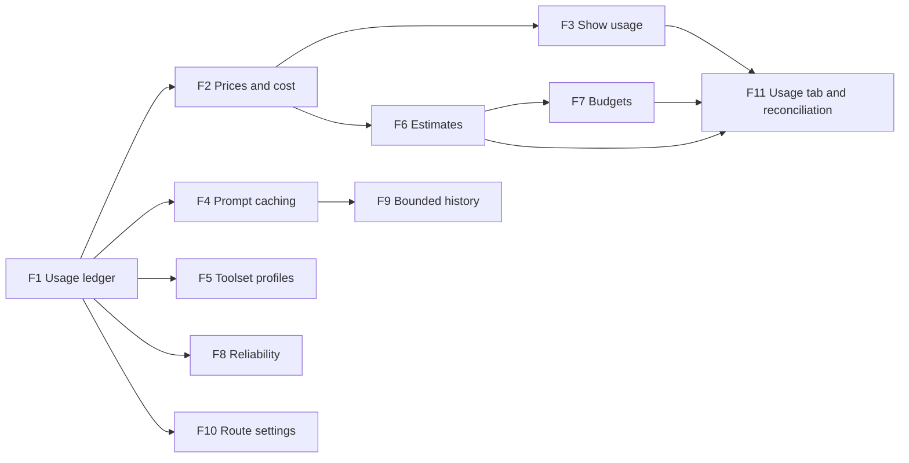

# Features: implementing the usage and optimisation specs

The [goal](../GOAL.md) these features serve: learning AI engineering, one measured skill per milestone. The two specs say **what** to build and why:

- [Usage, estimates and budgets](../specs/USAGE_AND_BUDGETS.md) (`U §n` below)
- [Response optimisation](../specs/RESPONSE_OPTIMISATION.md) (`R §n` below)

This folder says **how**, one feature at a time. Each feature doc has user stories with acceptance criteria, the
design (which code changes and how), step-by-step implementation tasks with their tests, and a definition of done.
Work through them in milestone order: each milestone is useful on its own, and later ones build on earlier ones.

## Features

Each feature is **one line under *Now* in the [TODO](../../TODO.md)** — tick it there when the feature is done. Where a
feature replaces older backlog wording, that wording no longer appears anywhere else in the TODO.

| ID | Feature | Status | Spec | Replaces in the TODO | Depends on | Milestone |
|---|---|---|---|---|---|---|
| [F1](F01-usage-ledger.md) | Usage ledger: record every model request | planned | U §4.1, §4.3 · R §A | *Track token usage / cost per session* (with F2, F3, F6, F7, F11) | — | M1 |
| [F2](F02-prices-and-cost.md) | Prices and cost | planned | U §4.2 | (as F1) | F1 | M1 |
| [F3](F03-usage-display.md) | Show usage: chat, CLI, Rider, API, comms log | planned | U §7.2–7.4 | (as F1) | F1, F2 | M1 |
| [F4](F04-prompt-caching.md) | Prompt caching (Anthropic) | planned | R §B | *Wire up Anthropic prompt caching* | F1 | M2 |
| [F5](F05-toolset-profiles.md) | Toolset profiles | planned | R §C | — | F1 | M2 |
| [F6](F06-estimates.md) | Cost estimates before a run | planned | U §5 | (as F1) | F1, F2 | M3 |
| [F7](F07-budgets.md) | Budgets: warn, ask, stop | planned | U §6 | (as F1) | F1, F2, F6 | M3 |
| [F8](F08-reliability.md) | Reliability: retries, account limits, fallback, structured results | planned | R §F · U §6.2 | *Retry and back off…*, *Add model fallback*, *Wire up structured outputs* | F1 | M3 |
| [F9](F09-context-management.md) | Bounded history: clear stale tool results, compact old turns | planned | R §D | *Consider context editing and compaction*; first slice of the session architecture | F1, F4 | M4 |
| [F10](F10-route-settings.md) | Settings per route: thinking, tool rounds, summary model | planned | R §E | Known limitation *10 tool rounds per message* | F1 | M4 |
| [F11](F11-usage-tab-and-reconciliation.md) | Usage tab, usage API, reconciliation with the bill | planned | U §7.1–7.2, §4.4 | (as F1) | F1–F3, F6, F7 | M5 |

## Milestones

| Milestone | Goal | Features | Proof it worked |
|---|---|---|---|
| **M1 — See it** | Every request's tokens and cost recorded and visible | F1, F2, F3 | A demo run produces `logs/usage.jsonl` and a comms log with cost per fix; the web app shows cost per answer |
| **M2 — Cheaper** | Stop paying full price for the same tokens | F4, F5 | Benchmark (demo run) input cost down ≥ 60% against the M1 baseline; 10/10 fixes still confirmed |
| **M3 — In control** | Know the cost before, stop cleanly at a limit | F6, F7, F8 | The demo script estimates the run; a run budget stops it cleanly and `-Resume` finishes it; an account-limit refusal stops the run at once |
| **M4 — Long sessions** | Long chats and tasks don't grow without limit | F9, F10 | A 30-turn chat stays under the compaction threshold and still recalls its first turns |
| **M5 — Reporting** | Usage overview and reconciliation | F11 | The Usage tab matches the ledger; the ledger is within 5% of the provider's report |

## The benchmark

Every milestone is measured the same way, so changes can be compared:

1. **Demo run** — `.\samples\run-demo.ps1` (13 errors, 10 fixes): tokens and cost per fix and in total, cache-hit rate,
   fixes confirmed by the orchestrator.
2. **Scripted chat** — a 30-turn conversation against louis-agent.api on the demo repository (to be written in F9): tokens
   per turn, and whether the last turns can still answer questions about the first.

The M1 run is the baseline. A change lands only if quality holds: 10/10 fixes confirmed, and the chat recall check passes.

## Conventions

- **Stories** are `Fn-Sm`: "As a *role*, I want *something*, so that *benefit*", each with acceptance criteria written
  as *Given / When / Then*.
- **Roles:** *user* (chats in the web app, Rider or CLI), *operator* (runs louis-agent and the orchestrator, sets
  budgets and prices), *developer* (works on this repo), *orchestrator* (the agent itself, where it is the one acting).
- **Tasks** are small enough for one commit each and name their test.
- **Definition of done** for every feature: its stories' criteria pass; unit tests added and the existing suites pass
  (`tests/louis-agent.core.tests`, `tests/louis-agent.orchestrator.tests`); the benchmark rerun where the feature
  touches cost; and the steps in *Finishing a feature* below.
- **Status** of each feature is kept in two places that must agree: the top of its doc and the table above
  (*planned → in progress → done*).

## Finishing a feature

When a feature's *Done when* is met, do all of this in the same commit, so the TODO, the specs and these docs never
drift apart:

1. **TODO:** tick the feature's line under *Now*, and add a one-line entry at the top of *Done*.
2. **This folder:** set *Status* to **done** at the top of the feature's doc and in the table above.
3. **Spec:** in the spec's *Implementation* map, mark the feature done; change anything the build proved different
   (for example F4's two cache markers instead of three).
4. **Limitations:** if the feature removes a known limitation (F10: tool rounds), delete it from both
   [docs/CLAUDE.md](../CLAUDE.md#known-limitations) and the TODO's *Known limitations*.
5. **Benchmark:** for features that change cost, add the measured numbers to *The benchmark* below.
6. **User docs:** settings in README / [SETUP](../SETUP.md), and anything the feature changes for users.
7. **Write-up:** when a skill in the [goal](../GOAL.md#what-im-learning-the-whole-agent-architecture) has nothing left
   missing (usually at a milestone's last feature), add or update its write-up in [docs/learning/](../learning/).

---
[Docs index](../README.md) · Specs: [Usage, estimates and budgets](../specs/USAGE_AND_BUDGETS.md) ·
[Response optimisation](../specs/RESPONSE_OPTIMISATION.md) · [TODO](../../TODO.md)
