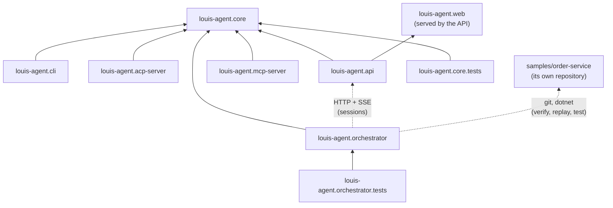

# Project design docs

One design doc per project in the solution: what it's for, how it works, its parts, its settings, how to extend it,
how it's tested, and its limits. For the whole system at once, read [Architecture](../ARCHITECTURE.md) first; come here
when you're about to change a particular project.

## The projects

| Project | Kind | In one line | Doc |
|---|---|---|---|
| `louis-agent.core` | Class library | The engine: tools, skills, the tool loop, providers, bootstrap | [core](louis-agent.core.md) |
| `src/louis-agent.cli` | Console app | Chat with the agent in a terminal | [cli](louis-agent.cli.md) |
| `src/louis-agent.acp-server` | Console app (stdio) | The agent inside JetBrains Rider's AI chat (Agent Client Protocol) | [acp-server](louis-agent.acp-server.md) |
| `src/louis-agent.api` | ASP.NET Core app | HTTP API with streamed answers, workspace and git endpoints; serves the web app | [api](louis-agent.api.md) |
| `src/louis-agent.web` | Blazor WebAssembly | The browser app: chats, files, changes, branches | [web](louis-agent.web.md) |
| `src/louis-agent.mcp-server` | Console / ASP.NET Core | Hands the agent's tools to any MCP client (no model of its own) | [mcp-server](louis-agent.mcp-server.md) |
| `src/louis-agent.orchestrator` | Console app | A second agent that watches a service's errors and has louis-agent fix them (POC) | [orchestrator](louis-agent.orchestrator.md) |
| `tests/louis-agent.core.tests`, `tests/louis-agent.orchestrator.tests` | NUnit | Unit tests for core and the orchestrator | [tests](tests.md) |
| `samples/order-service` | Console app + tests | The demo microservice with ten planted bugs (not in the solution) | [order-service](order-service.md) |

## How they depend on each other

Solid arrows are project references; dotted ones are runtime calls. Only `louis-agent.core` and the test projects are
referenced by other projects, and `louis-agent.core` references none of them. Behaviour lives in core; every host is a
thin adapter between its protocol and `AgentEngine`.

## Where each one runs

| Project | Run it with | Docker service |
|---|---|---|
| core | (library) | — |
| cli | `dotnet run --project src/louis-agent.cli` | `local-agent` |
| acp-server | Rider starts it per chat | `acp-server` (`docker compose run --rm -T acp-server`) |
| api + web | `docker compose … up -d api` → http://127.0.0.1:5080 | `api`; `demo-api` in the demo |
| mcp-server | an MCP client starts it (stdio), or HTTP with `MCP_TRANSPORT=http` | `mcp-server` |
| orchestrator | `samples/run-demo.ps1` | `orchestrator`, `demo-setup` (demo compose file) |
| order-service | inside the demo containers | — |

## Each doc covers

**Purpose** · **How it works** · **Structure** (files and what's in them) · **Key types** · **Configuration** ·
**Extending it** · **Tests** · **Limits and plans** (with links to [features](../features/README.md) and the
[TODO](../../TODO.md)) · **Related docs**.

---
[Docs index](../README.md) · Next: [louis-agent.core](louis-agent.core.md)
