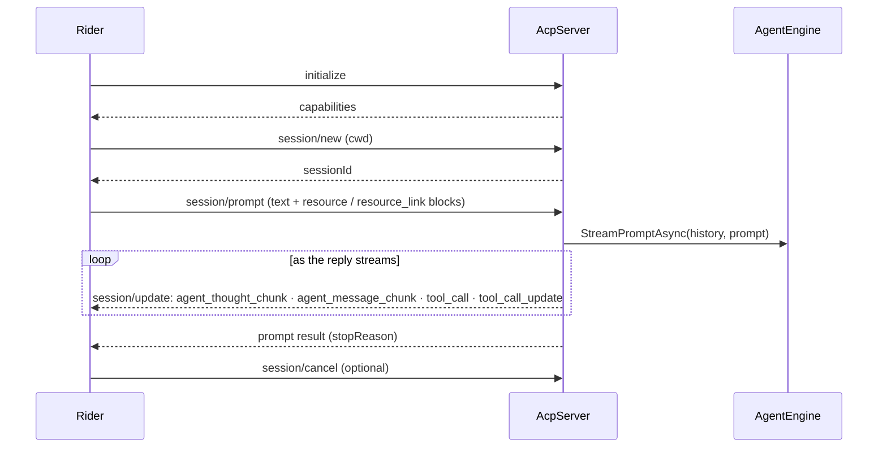

# louis-agent.acp-server — design

> **Kind:** console app (JSON-RPC over stdio) · **Path:** `src/louis-agent.acp-server/` · **References:**
> louis-agent.core · **Docker service:** `acp-server`, one container per Rider chat

## Purpose

Puts louis-agent inside JetBrains Rider's AI chat, using the [Agent Client Protocol](https://agentclientprotocol.com):
Rider sends prompts (with attached files), and the server streams back thinking, text and tool cards.

## How it works

- **One line = one JSON-RPC message** on stdin/stdout. Requests run concurrently; `session/cancel` is handled
  immediately and cancels that session's turn.
- **Sessions** (`SessionState`: working directory + history) live in memory for the container's lifetime; Rider starts a
  new container for each new chat (`docker compose run --rm -T acp-server`).
- **Prompt building:** `text` blocks are used as-is; embedded `resource` blocks are inlined; a `resource_link` is read
  from disk **only when the user attached it** (the file merely open in the editor is not sent). Attachments are capped
  at 100,000 characters.
- **Windows paths** from Rider are mapped to the container's mounts with `ACP_MOUNT_MAPPINGS`
  (`C:\Users\you\RiderProjects=/repositories`), falling back to a search under `/repositories`; a file that still isn't
  found is passed to the model as "could not be read — not inside a mounted folder", never guessed.
- **Tool cards:** each tool call becomes a `tool_call` (in progress) and a `tool_call_update` (completed or failed, with
  an output preview); the card's kind (read, edit, execute, search, fetch…) is guessed from the tool's name so Rider shows
  a fitting icon.
- `/tools`, `/approve`, `/reject` are answered by the engine without the model.

## Structure

| File | What's in it |
|---|---|
| `Program.cs` | `AgentHost.Build()` and `new AcpServer(engine).RunAsync()` |
| `AcpServer.cs` | The message loop, request handlers, prompt building, streaming to `session/update`, path mapping, cancellation |

## Configuration

Core settings plus `ACP_MOUNT_MAPPINGS`. Rider's agent-server entry: `config/rider-acp.example.json`.

**stdout carries the protocol:** anything written to `Console.Out` corrupts it — all logging goes to stderr.

## Extending it

Add a method in `HandleRequestAsync`'s switch; add a new `session/update` kind in the streaming method. Keep behaviour
in core: the server should only translate.

## Tests

No automated tests for the server itself (see [tests](tests.md)); check it in Rider after changes. Start a **New Chat**
to get a container with the new build.

## Limits and plans

- Sessions end with the container → [session architecture](../specs/SESSION_ARCHITECTURE.md) (backlog).
- An optional usage line at the end of answers → [F3](../features/F03-usage-display.md).

## Related docs

[How the agents and endpoints talk § Rider](../AGENT_COMMUNICATION.md#rider-and-the-acp-server) ·
[Quick start § Rider](../QUICK_START_AGENT.md) · [Setup](../SETUP.md)

---
[Projects](README.md) · Previous: [louis-agent.cli](louis-agent.cli.md) · Next: [louis-agent.api](louis-agent.api.md)
