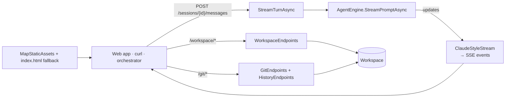

# louis-agent.api — design

> **Kind:** ASP.NET Core minimal API · **Path:** `src/louis-agent.api/` · **References:** louis-agent.core,
> louis-agent.web (served as static files) · **Docker service:** `api` (http://127.0.0.1:5080); `demo-api` in the demo

## Purpose

The agent over HTTP: sessions whose answers stream as Server-Sent Events shaped like Claude's, plus read-only workspace
browsing and a git interface. It also serves the web app. Other programs and agents (the orchestrator) use it to hand
louis-agent a whole task.

## How it works

- **Start-up** (`Program.cs`): `AgentHost.Build()`, register the engine, `AgentSessions` and a `WorkspaceTools` for path
  checks; add the API-key middleware when `AGENT_API_KEY` is set; map static assets, `/health`, `/prices`, workspace,
  git and history endpoints, and the session endpoints.
- **Prices** (`GET /prices`, public): the price table `AgentHost.Build` loaded for this API's usage ledger, so other
  hosts can set `PRICES_URL` to it and price with the same table (the demo's orchestrator does); `404` without one.
- **Sessions** (`AgentSessions`): in memory, one turn at a time per session (a second message gets `409`), cancelled by
  `POST /sessions/{id}/cancel` or by the client disconnecting; idle sessions are dropped after 4 hours.
- **Streaming** (`ClaudeStyleStream`): engine updates become `message_start`, `content_block_start/delta/stop`
  (thinking, text, tool_use, tool_result), `message_delta` (stop reason) and `message_stop`; failures become an `error`
  event in Claude's shape. `/tools`, `/approve`, `/reject` are answered without the model.
- **Workspace and git:** every path goes through core's `WorkspaceTools.ResolvePath` and `IsSensitive`, so the API applies
  the same boundary and secret-file rules as the agent; git runs without a shell with a 30-second timeout.
- **History and merging** (`HistoryEndpoints`): branches with ahead/behind counts, the log across branches, commit and
  branch diffs (secret files' content removed), `--no-ff` merges that abort cleanly on conflict, deletion of merged
  branches. Branch names are only accepted if they exist.

The full endpoint and event reference: [How the agents and endpoints talk](../AGENT_COMMUNICATION.md#the-http-api-louis-agentapi).

## Structure

| File | What's in it |
|---|---|
| `Program.cs` | Start-up, API-key middleware, `/health` and `/prices`, session endpoints, `StreamTurnAsync`, `ClaudeStyleStream` |
| `AgentSessions.cs` | `AgentSession` (id, history, turn lock, cancellation) and the in-memory session store |
| `WorkspaceEndpoints.cs` | `GET /workspace/entries`, `GET /workspace/file` (text ≤ 1 MB; secret files listed but not readable) |
| `GitEndpoints.cs` | `GET /git/status`, `GET /git/diff`, `POST /git/stage` · `unstage` · `discard` · `commit`; the git runner |
| `HistoryEndpoints.cs` | `GET /git/branches`, `/git/log`, `/git/commit`, `/git/branch`; `POST /git/merge`, `/git/branch/delete` |

## Configuration

Core settings, plus: `AGENT_API_KEY` (required on `/sessions`, `/workspace`, `/git` when set), `API_PORT` (host port in
Docker, bound to `127.0.0.1`), `GIT_AUTHOR_*` / `GIT_COMMITTER_*` (identity for commits and merges from the web app),
`ASPNETCORE_URLS` / `ASPNETCORE_ENVIRONMENT` outside Docker (an unpublished `dotnet run` only serves the web app in
`Development`).

## Extending it

- New endpoints in their own `*Endpoints.cs` with a `Map…` extension, following `HistoryEndpoints`; reuse
  `GitEndpoints.RunAsync` for git and `ApiErrors.Result` for errors (Claude's error shape).
- New stream content goes through `ClaudeStyleStream`, so every client sees the same event shapes.
- Anything that changes agent behaviour belongs in core, not here.

## Tests

No automated tests yet (backlog: *Automated tests for the API and the web app*); checked with curl and the browser. The
orchestrator demo exercises sessions, streaming and the git endpoints end to end.

## Limits and plans

- Sessions are in memory → [session architecture](../specs/SESSION_ARCHITECTURE.md).
- Usage in `message_delta` and session totals → [F3](../features/F03-usage-display.md); `/usage`, `/budgets`,
  `/estimates` → [F11](../features/F11-usage-tab-and-reconciliation.md); budget and account-limit errors →
  [F7](../features/F07-budgets.md), [F8](../features/F08-reliability.md); session tags and profiles →
  [F1](../features/F01-usage-ledger.md), [F10](../features/F10-route-settings.md).

## Related docs

[How the agents and endpoints talk](../AGENT_COMMUNICATION.md) · [louis-agent.web](louis-agent.web.md) ·
[Architecture § HTTP API](../ARCHITECTURE.md#http-api-and-web-app)

---
[Projects](README.md) · Previous: [louis-agent.acp-server](louis-agent.acp-server.md) · Next: [louis-agent.web](louis-agent.web.md)
