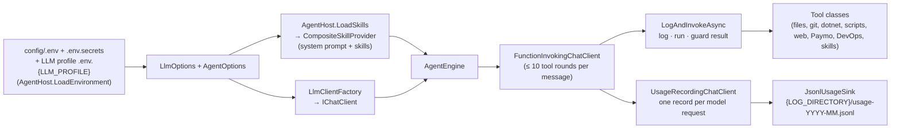

# louis-agent.core — design

> **Kind:** class library (`net10.0`) · **Path:** `louis-agent.core/` · **References:** Microsoft.Extensions.AI,
> Anthropic SDK, OpenAI and Ollama clients, dotenv.net · **Used by:** every host, the orchestrator, the tests

## Purpose

Everything that makes louis-agent an agent, independent of how you talk to it: the tools, the skills, the tool-call
loop, the model providers, configuration, logging and bootstrap. The hosts (CLI, Rider, API, MCP) only translate their
protocol to and from `AgentEngine`; behaviour changes belong here.

## How it works

1. **Bootstrap** (`AgentHost.Build()`): load `config/.env.secrets` then `config/.env` (searching upward from the working
   directory; variables already set win), bind `LlmOptions` and `AgentOptions`, start file logging, load skills, create
   the chat client, create `AgentEngine`, load approved agent-built tools, start Rider MCP discovery if enabled.
   `BuildToolHost()` does the same without a model, for the MCP server.
2. **A turn** (`StreamPromptAsync` / `ProcessPromptAsync`): append the user message to the history, send history + tools
   + reasoning settings to the model, let `FunctionInvokingChatClient` run tool calls (up to 10 rounds), stream thinking,
   text, calls and results to the host, then append the whole turn to the history.
3. **Guards** around every tool call: results over 50,000 characters are summarised by a separate tool-less call; a call
   cut off by the output limit is never run (and when streaming, the model is asked to continue, up to 3 times);
   exceptions go back to the model with their message.
4. **Usage** (F1): `UsageRecordingChatClient` sits inside the tool loop, so every model request (each tool round, each
   summary) writes one line to the usage ledger: token counts mapped by the provider's `IUsageMapper`, model, duration,
   stop reason, and the `UsageScope` the host opened for the turn (host, session, turn, purpose, task/run/service tags).
   Counts and ids only, never prompt text.

The full step-by-step is in [How a turn works](../AGENT_INTERACTION.md).

## Structure

| Path | What's in it |
|---|---|
| `AgentHost.cs` | Bootstrap for every host: env files, options, skills, client, engine; skill-file discovery |
| `AgentLog.cs` | Optional file logging (`LOG_DIRECTORY`): stderr copied per run, `oversized-tool-results.jsonl`, `truncated-tool-calls.jsonl` |
| `MarkdownSkillLoader.cs` | Parses `## Skill:` procedures (description, parameters, a bash / PowerShell / Python fence) from Markdown |
| `config/LlmOptions.cs` | `LLM_*`: provider (inferred from the model when unset), model, endpoint, key, tool support, thinking |
| `config/AgentOptions.cs` | Workspace, skills directory, `AGENT_FUNCTION`, keys for Paymo / DevOps / web search, Rider MCP, `LOG_DIRECTORY` |
| `providers/LlmClientFactory.cs` | Options → `IChatClient`: Anthropic (`AsIChatClient`, 16,000 output tokens, a fixed thinking budget for pre-4.6 models), Ollama, OpenAI-compatible |
| `providers/*SkillsProvider.cs` | One provider per skill file kind; `CompositeSkillProvider` joins them into the system prompt |
| `tools/AgentEngine.cs` | The engine: tool registration, system prompt, turn loop, guards, skills (`ExecuteSkill`, `CreateSkillFile`, `ReloadSkills`), agent-built tools (`CreateTool`, `/approve`) |
| `tools/WorkspaceTools.cs` | Files: read (≤ 1 MB), write, append, list, tree, search, find, copy, rename, delete; workspace boundary and secret-file checks |
| `tools/GitTools.cs` | 35 git operations, run without a shell, 30-second timeout |
| `tools/DotNetTools.cs` | Build, test, run, restore, clean, packages, SDK info — parsed into compact results |
| `tools/PythonTools.cs`, `PowerShellTools.cs`, `BashTools.cs` | Run scripts with arguments as data (Python in its own venv; bash is Git Bash on Windows, never WSL) |
| `tools/WebTools.cs`, `WebSearchProviders.cs` | `WebSearch` (Google or DuckDuckGo) and `FetchUrl` (HTML → text; private addresses blocked on every hop) |
| `tools/PaymoTools.cs`, `DevOpsTools.cs` | Paymo time tracking and Azure DevOps work items — only registered when their keys are set |
| `tools/ScriptTool.cs` | Agent-built tools from `*.tool.md`: typed parameters, arguments validated and passed as JSON on stdin |
| `tools/ProcessRunner.cs` | The one way to start processes: argument lists, no shell, timeouts, bounded output |
| `mcp/RiderMcpClient.cs`, `RiderMcpToolDiscovery.cs` | Lists Rider's MCP tools (logged only; not callable yet) |
| `usage/UsageRecordingChatClient.cs` | Middleware that records one `UsageRecord` per model request, streaming or not; a cancelled stream is recorded as `cancelled`, a provider error isn't |
| `usage/UsageScope.cs` | The turn's context in an `AsyncLocal`: host, session, turn, purpose, `UsageTags` (task, run, service); `Activate()` for hosts that stream from an async iterator |
| `usage/IUsageMapper.cs` | Provider usage → input / cache write / cache read / output / reasoning: `StandardUsageMapper` (the Microsoft.Extensions.AI contract), `AnthropicUsageMapper` (cache writes) |
| `usage/UsageRecord.cs`, `IUsageSink.cs`, `JsonlUsageSink.cs` | The record (with its `UsageCost`), and the monthly JSONL file it's written to (shared append, UTC month) |
| `usage/PriceTable.cs`, `CostCalculator.cs` | `config/prices.json` (longest-prefix match, a `long_prompt` tier) and a record's cost; no price → `null`, never 0 |
| `usage/PricingUsageSink.cs` | Wraps the ledger in `AgentHost.CreateUsageSink`: prices each record before it's written |
| `usage/UsageReport.cs` | Reads a ledger back, prices records written before F2, totals by any key (`WorkOf`: a fix, a triage, a session) |

## Key types

| Type | Role |
|---|---|
| `AgentHost` | Static bootstrap: `LoadEnvironment`, `Build`, `BuildToolHost`, `LoadSkills`, `CreateUsageSink` |
| `UsageScope` | Open one per turn in a host (`Begin(host:, session:, turn:, tags:)`); every request inside it is attributed to it |
| `AgentEngine` | `StreamPromptAsync`, `ProcessPromptAsync`, `NewHistory`, `HandleUserCommand` (`/tools`, `/approve`, `/reject`), `Tools` and `ToolsChanged`, `RunAsync` / `RunSinglePromptAsync` (the CLI loop). Optional `toolsets:` replaces the coding tools with your own objects (used by the orchestrator) |
| `ISkillProvider` | `Documentation` (system prompt text) + `Skills` (runnable procedures) |
| `ILlmClientFactory` | Builds the `IChatClient`; tests inject a fake |
| `WorkspaceTools.ResolvePath` / `IsSensitive` | Internal, also used by the API's file and git endpoints so the same rules apply |

**Every public method on a tool class becomes a tool**, named after the method, described by its `[Description]`
attributes (108 tools with Paymo and DevOps enabled). Helpers must be `internal` or `private`.

## Configuration

`LLM_PROVIDER`, `LLM_MODEL`, `LLM_ENDPOINT`, `LLM_API_KEY` / `ANTHROPIC_API_KEY`, `ANTHROPIC_WORKSPACE_ID`,
`LLM_SUPPORTS_TOOLS`, `LLM_THINKING`, `LLM_PROFILE`, `WORKSPACE_ROOT`, `SKILLS_DIRECTORY`, `AGENT_FUNCTION`,
`LOG_DIRECTORY`, `USAGE_LEDGER`, `PRICES_FILE`, `PRICES_URL`,
`PAYMO_API_KEY`, `DEVOPS_API_KEY`, `DEVOPS_ORGANIZATION`, `DEVOPS_PROJECT`, `DEVOPS_TEAM`, `WEB_SEARCH_PROVIDER`,
`GOOGLE_SEARCH_API_KEY`, `GOOGLE_SEARCH_ENGINE_ID`, `RIDER_MCP_*`, `BASH_PATH`. All read once at start-up in
`LlmOptions` / `AgentOptions` — tools never read the environment themselves. Details: [Setup](../SETUP.md),
[Models](../MODELS.md).

## Extending it

- **A tool:** a public method with `[Description]`s on a tool class; a new class is registered in the `AgentEngine`
  constructor; mention it in a skill file; test it in `tests/louis-agent.core.tests/Tools/`.
- **A skill:** `Skills/{name}-skills.md`; loaded with `AGENT_FUNCTION={name}` or `louis`.
- **A provider:** a branch in `LlmClientFactory`; provider differences never go into `AgentEngine` or the tools.
- **Another agent:** `new AgentEngine(skills, client, options, toolsets: [yourTools])`, as the orchestrator does; pass
  `usageSink: AgentHost.CreateUsageSink(options)` and the factory's `CreateUsageMapper` to record its usage.
- **A host:** open a `UsageScope` per turn, or its records have no host, session or turn.
- **A provider's usage:** if `tools/louis-agent.usage-probe` shows it reports differently, add an `IUsageMapper` and pick
  it in `LlmClientFactory.CreateUsageMapper`.

Details: [Development guide](../CLAUDE.md#development-workflow).

## Security

Paths stay inside the workspace (no `..`, no following symbolic links); secret files (`.env*`, keys, certificates,
`credentials.json`, …) can't be read, written, searched or diffed; processes get argument lists or environment
variables, never model text spliced into a command line; `FetchUrl` blocks private, loopback and metadata addresses.

## Tests

`tests/louis-agent.core.tests` — see [tests](tests.md). No network, model or Docker needed.

## Limits and plans

- 10 tool rounds per message → [F10](../features/F10-route-settings.md); nothing cached → [F4](../features/F04-prompt-caching.md);
  usage recorded but not priced → [F2](../features/F02-prices-and-cost.md); history grows unbounded → [F9](../features/F09-context-management.md);
  every toolset always loaded → [F5](../features/F05-toolset-profiles.md).
- Rider MCP discovery only logs; Ollama tool support is a name heuristic; Paymo task lookup takes the first match
  ([known limitations](../CLAUDE.md#known-limitations)).

## Related docs

[Architecture](../ARCHITECTURE.md) · [How a turn works](../AGENT_INTERACTION.md) · [Development guide](../CLAUDE.md) ·
[Setup](../SETUP.md) · [Models](../MODELS.md)

---
[Projects](README.md) · Next: [louis-agent.cli](louis-agent.cli.md)
