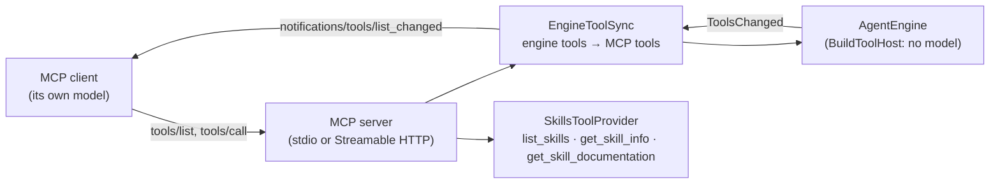

# louis-agent.mcp-server — design

> **Kind:** console app (stdio) or ASP.NET Core (Streamable HTTP) · **Path:** `src/louis-agent.mcp-server/` ·
> **References:** louis-agent.core, the ModelContextProtocol SDK · **Docker service:** `mcp-server`

## Purpose

Hands louis-agent's tools to any [Model Context Protocol](https://modelcontextprotocol.io) client — Claude Desktop, Rider,
or an agent built on another SDK. It has **no model of its own**: the client's model decides which tool to call, one
call at a time. (To have louis-agent do a whole task itself, use the API's sessions instead —
[which interface to use](../AGENT_COMMUNICATION.md#which-interface-to-use).)

## How it works

- **Start-up:** `AgentHost.BuildToolHost()` — the same engine, skills and agent-built tools as the other hosts, with a
  stand-in chat client that refuses to be called.
- **Transport** by `MCP_TRANSPORT`: `stdio` (default; the client starts the server as a subprocess) or `http` (Streamable
  HTTP via `MapMcp()`, for remote clients, port 8080 in the container → `127.0.0.1:${MCP_PORT:-5090}`).
- **Tools:** `EngineToolSync` mirrors `AgentEngine.Tools` into the MCP tool collection and keeps it in sync: when the
  agent builds or approves a tool, clients get `notifications/tools/list_changed`. `SkillsToolProvider` adds three
  read-only skill tools; skills themselves run through the engine's `ExecuteSkill`.
- **Auth (HTTP only):** `MCP_API_KEY` (falls back to `AGENT_API_KEY`) as `x-api-key` or `Authorization: Bearer`,
  compared in constant time. Without a key it logs a warning and accepts every request — so keep it on `127.0.0.1`.
- **Approval stays with the user:** approving agent-built tools is not exposed over MCP.

## Structure

| File | What's in it |
|---|---|
| `Program.cs` | Transport choice, `RunStdioAsync`, `RunHttpAsync` (with the key middleware), `EngineToolSync`, `SkillsToolProvider` |

## Configuration

Core settings (no `LLM_*` needed), plus `MCP_TRANSPORT`, `MCP_PORT`, `MCP_API_KEY`. Client entry for Rider:
`config/.rider-mcp-servers.json`.

**In stdio mode stdout carries the protocol**: logging goes to stderr only.

## Extending it

New engine tools appear automatically. MCP-only additions (like the skill tools) go in their own `[McpServerToolType]`
class registered with `.WithTools<…>()` in both transports.

## Tests

None for the server itself; the tools it publishes are tested in `tests/louis-agent.core.tests`. Checked with an MCP
client and, for HTTP, with curl (no key → 401, right key → 200).

## Limits and plans

- Without `MCP_API_KEY` the HTTP transport is unauthenticated (by design for local use; documented).
- Toolset profiles ([F5](../features/F05-toolset-profiles.md)) would also let an MCP server publish only some tools.

## Related docs

[How the agents and endpoints talk § MCP](../AGENT_COMMUNICATION.md#mcp-clients-and-the-mcp-server) ·
[Architecture § MCP server](../ARCHITECTURE.md#mcp-server) · [Setup](../SETUP.md)

---
[Projects](README.md) · Previous: [louis-agent.web](louis-agent.web.md) · Next: [louis-agent.orchestrator](louis-agent.orchestrator.md)
