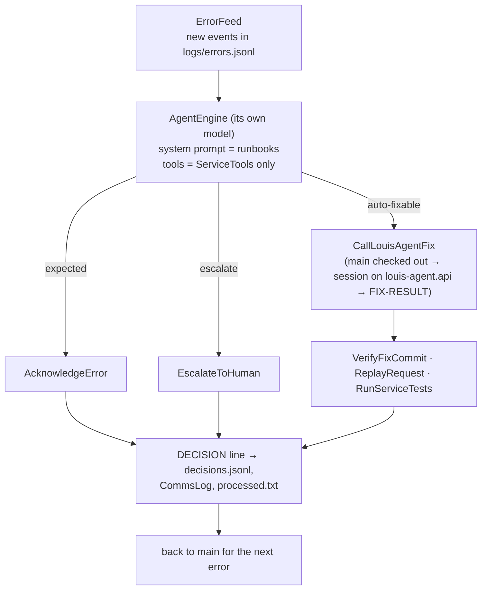

# louis-agent.orchestrator — design

> **Kind:** console app · **Path:** `src/louis-agent.orchestrator/` · **References:** louis-agent.core · **Talks to:**
> louis-agent.api over HTTP + SSE · **Docker services:** `orchestrator`, `demo-setup` (`docker/docker-compose.demo.yml`) ·
> **Status:** proof of concept

## Purpose

A second agent, built on the same core, that watches one microservice's error log, decides what each exception needs
from a **runbook per API method**, has louis-agent fix the ones the runbook allows, and then checks louis-agent's work
itself before calling anything fixed. It never edits code.

## How it works

1. **Poll** (`Program.cs`): read new events from the service's error log (`ErrorFeed` remembers processed ids in
   `processed.txt`, so each is triaged once; a failed triage stays unprocessed for the next run). `--once` runs one pass.
2. **Triage** each event with a fresh history: the runbooks are the system prompt, the event is fenced as untrusted data,
   and the model's only tools are `ServiceTools` (via `AgentEngine`'s `toolsets:`).
3. **Fix** (`CallLouisAgentFix`): check `main` out (stashing leftovers), open a session on louis-agent.api, send the fix
   request, stream the reply, send "continue" up to three times if it ends without a `FIX-RESULT`, then delete the
   session.
4. **Verify** — a claim is not proof: the commit exists on the fix branch, which starts from `main` and is not on `main`;
   the failing request now returns 200; the whole test suite passes.
5. **Record**: the `DECISION` line, `fixes.jsonl` / `escalations.jsonl` / `acknowledged.jsonl`, and every message both
   ways in the Markdown `agent-comms.md`.

## Structure

| Path | What's in it |
|---|---|
| `Program.cs` | Start-up, the poll loop, the triage prompt, `Decision` parsing, runbook loading (`OrchestratorSkills`) |
| `ServiceTools.cs` | The orchestrator's only tools: `CallLouisAgentFix`, `VerifyFixCommit`, `ReplayRequest`, `RunServiceTests`, `EscalateToHuman`, `AcknowledgeError`; the fix prompt; returning to `main` |
| `LouisAgentClient.cs` | Sessions on louis-agent.api, SSE parsing into `AgentReply` (text, tool calls with inputs and results), `FIX-RESULT` parsing |
| `ErrorFeed.cs` | Reads the error log, skips processed and malformed events, accepts only plain-token ids |
| `CommsLog.cs` | The Markdown conversation log: per error, messages, replies, checks, summary; a run summary table |
| `OrchestratorOptions.cs` | Settings |
| `Skills/orchestrator.md` | The workflow every error goes through |
| `Skills/<service>/` | `service.md` (owners, policies) and one runbook per API method — see [Runbooks](../RUNBOOKS.md) |

## Configuration

`ORCHESTRATOR_SERVICE_ROOT` (required), `ORCHESTRATOR_SERVICE`, `ORCHESTRATOR_SERVICE_PROJECT`, `LOUIS_AGENT_URL`,
`LOUIS_AGENT_API_KEY` (falls back to `AGENT_API_KEY`), `ORCHESTRATOR_STATE_DIRECTORY`, `ORCHESTRATOR_COMMS_LOG`,
`ORCHESTRATOR_POLL_SECONDS`; the model from the usual `LLM_*` settings. The demo compose file sets them all.

## Extending it

- **A method or service:** a runbook in `Skills/<service>/` ([Runbooks](../RUNBOOKS.md#adding-and-changing-runbooks)).
- **A tool:** a public method with `[Description]`s on `ServiceTools` — remember every public method becomes a tool.
- **Build mode** (building methods from runbooks) is planned as a separate sample → *Next* in the [TODO](../../TODO.md).

## Tests

`tests/louis-agent.orchestrator.tests` — see [tests](tests.md): the feed, the SSE client and `FIX-RESULT`, decisions,
runbook loading, the comms log, and the git checks against a throwaway repository. The whole loop runs in the demo
against a real model.

## Limits and plans

- POC choices: a JSON-lines error log instead of an error tracker, a local branch instead of a pull request, polling
  only → [orchestrator design](../specs/ORCHESTRATOR_DESIGN.md) and the TODO backlog.
- Cost per fix, estimates, budgets, stopping at account limits, results as tool calls →
  [F3](../features/F03-usage-display.md), [F6](../features/F06-estimates.md), [F7](../features/F07-budgets.md),
  [F8](../features/F08-reliability.md).

## Related docs

[Orchestrator demo](../../samples/README.md) · [Runbooks](../RUNBOOKS.md) ·
[Agent to agent](../AGENT_COMMUNICATION.md#agent-to-agent-the-orchestrator-and-louis-agent) ·
[Orchestrator design](../specs/ORCHESTRATOR_DESIGN.md)

---
[Projects](README.md) · Previous: [louis-agent.mcp-server](louis-agent.mcp-server.md) · Next: [louis-agent.usage-probe](louis-agent.usage-probe.md)
