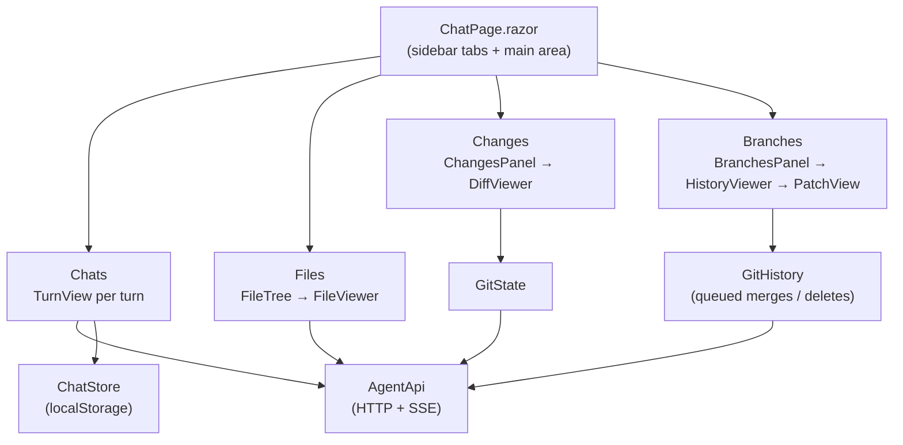

# louis-agent.web — design

> **Kind:** Blazor WebAssembly app · **Path:** `src/louis-agent.web/` · **Served by:** louis-agent.api (same origin) ·
> **References:** Markdig (Markdown), highlight.js (from a CDN)

## Purpose

The browser front end: chat with the agent, browse the workspace, review and commit changes, and review and merge
branches — on top of louis-agent.api.

## How it works

- **One page, four tabs.** `ChatPage` holds the sidebar (Chats, Files, Changes, Branches, theme, API key) and the main
  area, which shows a chat, a file, a diff, or a branch/commit.
- **Chats** stream from `POST /sessions/{id}/messages`: `ChatPage.Apply` turns each SSE event into `Turn` / `Block`
  objects (thinking, text, tool card); `TurnView` renders them, re-rendering at most every 50 ms while streaming.
  Answers are rendered from Markdown **without raw HTML** (`Markdown.cs`), and code is highlighted.
- **Chats are kept in the browser** (`ChatStore`, `localStorage`); the server only holds the session, so after an API
  restart a chat can be read but not continued.
- **Shared state services** raise `Changed` events so panels, viewers and tab badges stay in step:
  `GitState` (working-tree status, stage / unstage / discard / commit) and `GitHistory` (branches and log; **merges and
  deletes are queued and run in click order**, each row showing *Merging… / Queued / deleting…*).
- **Themes** are CSS files in `wwwroot/css/themes/` listed in `themes.json`; each sets the variables listed at the top of
  `css/app.css`.

## Structure

| Path | What's in it |
|---|---|
| `Pages/ChatPage.razor` | The page: tabs, chat flow, stream handling, opening files / diffs / branches, merge and delete actions |
| `Components/TurnView.razor` | One turn: user message, thinking (collapsible), text, tool cards |
| `Components/FileTree.razor`, `FileViewer.razor` | Workspace browser and file view (with "Ask agent to review") |
| `Components/ChangesPanel.razor`, `DiffViewer.razor` | Changed files, selection, stage / unstage / discard / commit; one file's diff |
| `Components/BranchesPanel.razor`, `HistoryViewer.razor`, `PatchView.razor` | Branches to merge, merged branches, all commits; a branch's or commit's diff |
| `Components/ThemeSwitcher.razor` | Theme selection |
| `Services/AgentApi.cs` | Typed client for every API call; SSE parsing; errors as `AgentApiException` |
| `Services/ChatStore.cs` | Chats and the API key in `localStorage` |
| `Services/GitState.cs`, `GitHistory.cs` | Shared git state with change events; the merge/delete queue |
| `Models.cs` | `Chat`, `Turn`, `Block`, workspace and git records |
| `Markdown.cs` | Markdig pipeline: raw HTML shown as text, only http(s)/mailto links |
| `wwwroot/` | `index.html`, `css/app.css`, themes, `js/chat.js` (scrolling, focus, cross-tab sync of chats) |

## Configuration

None of its own: it calls the API on the same origin. If the API requires `AGENT_API_KEY`, the user enters it under
*API key* in the sidebar (kept in this browser only).

## Extending it

- A new tab: a `…Panel` component in the sidebar plus a viewer for the main area, wired in `ChatPage` (the Branches tab
  is the most recent example); shared data in a `…State` service with a `Changed` event.
- New API calls in `AgentApi`; never call `HttpClient` from components.
- A theme: copy `paper.css`, set the variables, add a line to `themes.json`.

## Tests

None automated yet (backlog: *Automated tests for the API and the web app*, Branches queue first); checked in a browser.

## Limits and plans

- Chats live in one browser only → backlog *Sync chat history across devices*.
- Skills and agent-built tools are managed by typing commands → backlog *A UI for skills*.
- Cost per answer and chat totals → [F3](../features/F03-usage-display.md); a Usage tab →
  [F11](../features/F11-usage-tab-and-reconciliation.md); a budget "continue?" prompt → [F7](../features/F07-budgets.md).

## Related docs

[README § Web app](../../README.md#web-app) · [Quick start](../QUICK_START_AGENT.md) · [louis-agent.api](louis-agent.api.md)

---
[Projects](README.md) · Previous: [louis-agent.api](louis-agent.api.md) · Next: [louis-agent.mcp-server](louis-agent.mcp-server.md)
