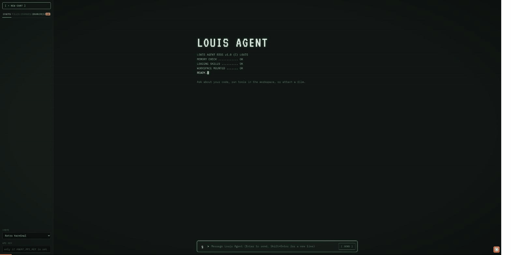

# Orchestrator demo: one agent watching a microservice

A proof of concept for the "one orchestrator per microservice" design in [TODO.md](../TODO.md#design-one-orchestrator-per-microservice):
an orchestrator agent watches a service's errors, decides what each one needs from a runbook per API method, hands
code fixes to louis-agent, and then checks louis-agent's work itself. Each fix lands as one commit on its own branch;
you review and merge the branches in the web app. Nothing is pushed, and everything runs in Docker.

```
order-service ──errors.jsonl──▶ orchestrator ──POST /sessions (SSE)──▶ louis-agent.api ──▶ fix/<method>-<id> branch
 (samples/)                     (louis-agent.core,                     (WORKSPACE_ROOT =        one commit, from main
                                 runbook per method)                    the service repo)
                                      │                                        │
                                      ├─ verifies: commit in git, replay, tests  └─ web app: Branches tab → Merge
                                      └─ writes every message to agent-comms.md
```

## Run it

```powershell
.\samples\run-demo.ps1             # a clean run: about 15 minutes (the first run also builds the images)
.\samples\run-demo.ps1 -Resume     # keep .demo; triage only the errors not handled yet (e.g. after running out of credits)
.\samples\run-demo.ps1 -ApiOnly    # keep .demo; just (re)start the web app
.\samples\run-demo.ps1 -StopApi    # stop demo-api at the end instead of leaving it up
```

Needs Docker Desktop and `ANTHROPIC_API_KEY` in `config/.env.secrets`; nothing else runs on the host. The script drives
[`docker/docker-compose.demo.yml`](../docker/docker-compose.demo.yml):

1. **demo-setup** (orchestrator image) copies `samples/order-service` to `.demo/order-service` (git-ignored) as a fresh
   git repository on `main`, then replays `data/requests.txt`, which logs 13 exceptions to `logs/errors.jsonl`;
2. **demo-api** (the louis-agent api image) runs louis-agent.api and the web app on `http://127.0.0.1:5081`, with that
   repository as its workspace;
3. **orchestrator** triages every new error once (`--once`), calling demo-api over the compose network for fixes;
4. the fix branches and the run summary are printed, and demo-api is left running, so you can open
   **http://127.0.0.1:5081** and merge the fixes (below).

All three containers mount the host's `.demo/` at `/demo`, so the repository has the same path everywhere (stack
traces in the error log match louis-agent's workspace), and `agent-comms.md`, the logs and the repository can be read
on the host. A shared `nuget` volume means the service's packages are restored once. Stop the web app with
`docker compose -f docker/docker-compose.demo.yml stop demo-api`.

To see the result without running it, look at [sample-output/](sample-output/README.md): the comms log, logs and
branches from one clean run, and a recording of merging its ten fixes in the web app:



## The pieces

| Piece | Where | Role |
|---|---|---|
| order-service | `samples/order-service` (runs in the demo-setup container; replays run in the orchestrator's) | A console stand-in for a microservice: 11 API methods over `data/orders.csv`, one file each in `src/OrderService/Api/`. Unhandled exceptions go to `logs/errors.jsonl`, standing in for Exceptionless. |
| Orchestrator | `src/louis-agent.orchestrator` (`docker/Dockerfile.orchestrator`) | An `AgentEngine` from `louis-agent.core` whose system prompt is the runbooks and whose only tools are `ServiceTools` (no file, git or shell tools). |
| Runbooks | `src/louis-agent.orchestrator/Skills/` | `orchestrator.md` (workflow), `order-service/service.md` (owners, deploy policy) and one file per API method: what it does, which exceptions are expected, auto-fixable or escalated, and the correct behaviour. |
| louis-agent | `src/louis-agent.api` (the demo-api container) | Does each fix with its usual tools: branch from `main`, edit, regression test in a new file, build, test, commit, then a `FIX-RESULT` line. |

## What the demo traffic triggers

Ten bugs, one per API method, each fixed on its own branch:

| Request | Exception | Cause | Fix the runbook asks for |
|---|---|---|---|
| `get-order 1006` | `ArgumentOutOfRangeException` | order without items | summary says 0 items |
| `order-total 1003` | `KeyNotFoundException` | retired discount code `SUMMER25` | unknown codes give no discount |
| `shipping-cost 1006` | `DivideByZeroException` | order without items | nothing to ship costs 0.00 |
| `invoice-number 1007` | `FormatException` | `created` has a time (`…T14:05:00Z`) | accept dates with a time |
| `packing-slip 1001` | `NullReferenceException` | no gift message | print the items only |
| `loyalty-points 1008` | `OverflowException` | a 25,000,000.00 order | correct points for any size |
| `vat 1009` | `KeyNotFoundException` | country `nl` in lower case | match country codes case-insensitively |
| `delivery-estimate 1010` | `IndexOutOfRangeException` | ordered on a Sunday | Sunday dispatches on Monday |
| `discount-label 1011` | `FormatException` | code `FREESHIP` has no percentage | show such codes as-is |
| `customer-initials 1012` | `IndexOutOfRangeException` | single name `Cher` | one initial |

And three that must not be fixed:

| Request | Exception | Runbook says | Orchestrator does |
|---|---|---|---|
| `refund 1002` | `InvalidOperationException` "already been refunded" | expected | `AcknowledgeError` |
| `refund 1005` | `ArgumentOutOfRangeException` (no card reference) | payments: never auto-fix | `EscalateToHuman` (payments) |
| `get-order 9999` | `OrderNotFoundException` | expected (404) | `AcknowledgeError` |

## How a fix is confirmed

louis-agent's `FIX-RESULT` (status, commit, branch, tests) is a claim. The orchestrator only reports `fixed` when all
three of its own checks pass:

1. `VerifyFixCommit` — in the service's git repository, the commit exists, is on the reported fix branch (checked
   out), the branch starts from the tip of `main`, the commit is **not** on `main`, it changed files, and the working
   tree is clean; it shows the author (`louis-agent`).
2. `ReplayRequest` — the failing call now answers `200` (replays write to their own error log, not production's).
3. `RunServiceTests` — the whole suite passes, including louis-agent's regression test.

Anything else is escalated. Between errors the orchestrator checks `main` out again (stashing anything an unfinished
fix left behind), so every fix branch starts from `main` and holds exactly one fix.

## The agent communications log

`.demo/agent-comms.md` (set with `ORCHESTRATOR_COMMS_LOG`) records the whole conversation, one section per error:

- the error event;
- **Orchestrator → louis-agent**: every message, verbatim (the fix request, and any "continue" follow-ups);
- **louis-agent → orchestrator**: every reply: a table of the tools it called (inputs and results, shortened), its
  text verbatim, and the `FIX-RESULT` it ended with;
- **Orchestrator actions and checks**: verify, replay and test results, or the acknowledgement/escalation;
- **Summary**: the decision, louis-agent's claim, branch, commit, and the orchestrator's closing answer.

It ends with a **run summary** table (one row per error: decision, louis-agent's result, branch, commit) and the list
of branches ready to merge, which is the part to check when testing.

## Reviewing and merging the fixes in the web app

Open **http://127.0.0.1:5081** and go to the **Branches** tab (the badge counts branches waiting to be merged):

- **To merge** lists each `fix/...` branch with its commit. Click one to see its commit and the full diff it would
  bring into the checked-out branch (`main`), then **Merge into main**. A merge is a `--no-ff` merge commit; if it
  would conflict, it is aborted and nothing changes.
- **Merged** lists merged branches; **×** deletes one (only merged branches can be deleted).
- **All commits** is the log across every branch; click a commit to see its diff.

Merges stay local: pushing is left to you. The web app refuses to merge while `main` has uncommitted changes.

## Outputs

`.demo/` on the host holds everything: `agent-comms.md`, the repository (`order-service/`), louis-agent.api's logs
(`logs/`), and `orchestrator-state/` with `decisions.jsonl`, `fixes.jsonl` (louis-agent's replies),
`escalations.jsonl`, `acknowledged.jsonl` and `processed.txt` (so an error is triaged once). Container output:
`docker compose -f docker/docker-compose.demo.yml logs demo-api`.

## Running the parts yourself

```powershell
docker compose -f docker/docker-compose.demo.yml --env-file config/.env run --rm demo-setup    # fresh repo + traffic
docker compose -f docker/docker-compose.demo.yml --env-file config/.env up -d --wait demo-api  # louis-agent.api + web app
docker compose -f docker/docker-compose.demo.yml --env-file config/.env run --rm orchestrator  # triage new errors once
```

`DEMO_RESET=0` makes demo-setup keep `.demo` as it is; `DEMO_PORT` changes the web app's port (default 5081). The
compose file sets the orchestrator's settings below; outside Docker they are plain environment variables.

| Setting | Default | Meaning |
|---|---|---|
| `ORCHESTRATOR_SERVICE_ROOT` | (required) | The service's git repository: the same folder as louis-agent.api's `WORKSPACE_ROOT` |
| `ORCHESTRATOR_SERVICE` | `order-service` | Selects `Skills/{service}/` |
| `ORCHESTRATOR_SERVICE_PROJECT` | `src/OrderService` | Project used to replay requests |
| `LOUIS_AGENT_URL` | `http://127.0.0.1:5081` | The louis-agent.api instance for this service |
| `LOUIS_AGENT_API_KEY` | `AGENT_API_KEY` | Sent as `x-api-key` when louis-agent.api requires a key |
| `ORCHESTRATOR_STATE_DIRECTORY` | `logs/orchestrator/{service}` | Decisions, fixes, escalations, processed ids |
| `ORCHESTRATOR_COMMS_LOG` | `{state directory}/agent-comms.md` | The Markdown log of every message between the agents |
| `ORCHESTRATOR_POLL_SECONDS` | `15` | Poll interval when not run with `--once` |

The model is louis-agent's usual `LLM_*` configuration.

## Adding a service or a method

- **A method:** add `Skills/{service}/{method}.md` with a `## Method: {method}` runbook. The file name is the method
  name the error events carry; `ReplayRequest` only accepts methods that have a runbook.
- **A service:** add `Skills/{service}/service.md` plus its method runbooks, run one orchestrator per service with
  `ORCHESTRATOR_SERVICE={service}`, and point it at that service's own louis-agent.api instance.

## Differences from the design in TODO.md

- The orchestrator is built on `louis-agent.core` (`AgentEngine` with a custom toolset) rather than Anthropic's Tool
  Runner, so it reuses louis-agent's providers, skills loader and tool loop.
- The error feed is a JSON-lines file instead of the Exceptionless API, and a fix ends as a commit on a fix branch
  (the demo repository has no remote) instead of a pull request; you merge it in the web app.
- In the demo, louis-agent.api runs with a `louis-agent` git identity, so merges made from the web app are also
  recorded under that name.
